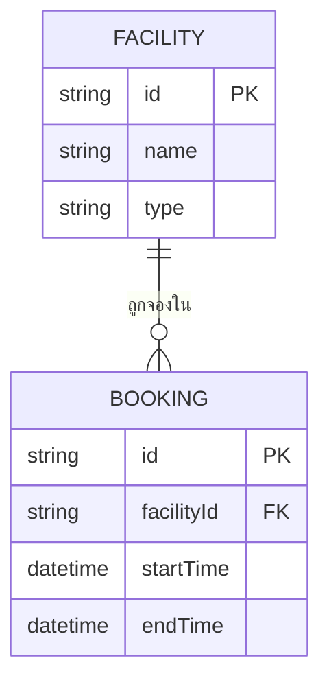
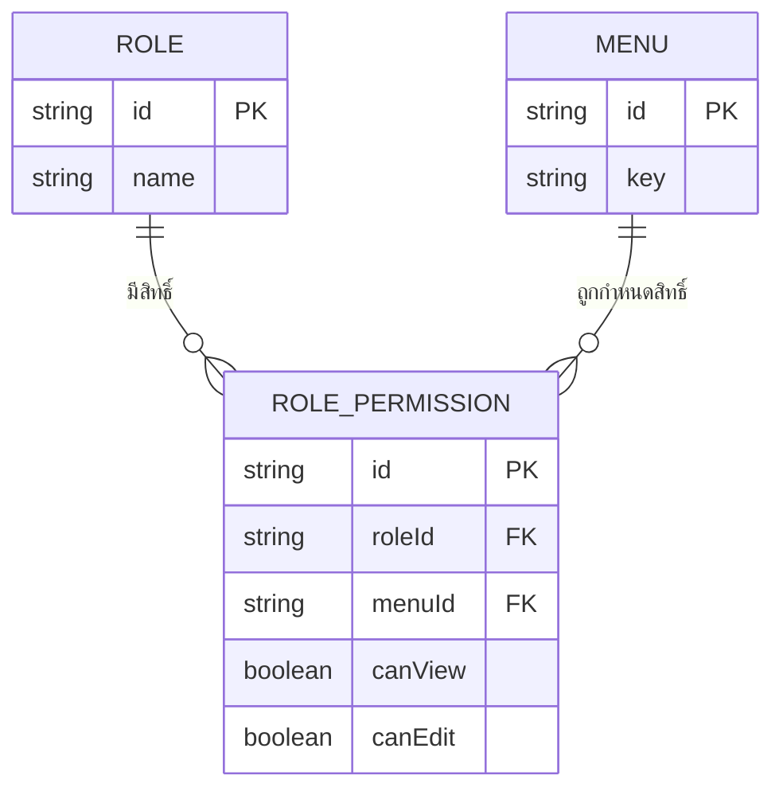
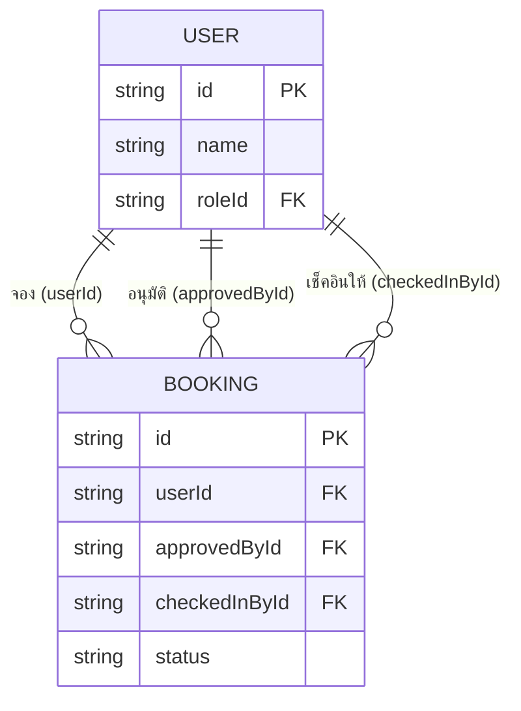
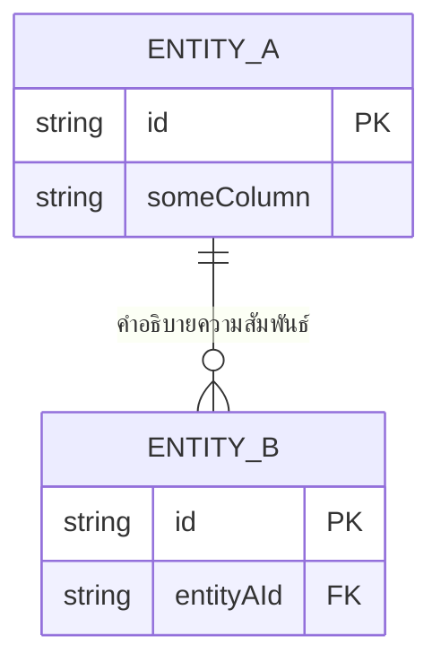
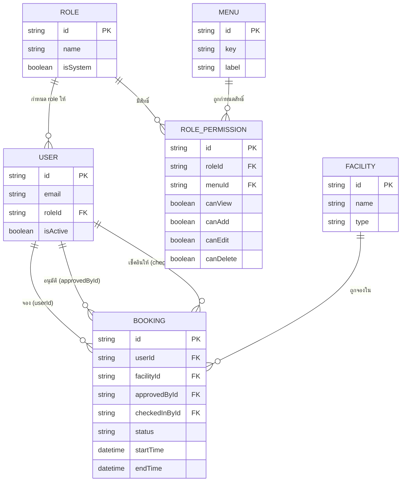

# คู่มือเรียนวาด Database (ER Diagram) แบบเข้าใจง่าย

เอกสารนี้สอนวิธี "อ่าน" และ "เขียน" **ER Diagram** (Entity-Relationship Diagram — แผนภาพความสัมพันธ์ของตารางในฐานข้อมูล) ตั้งแต่พื้นฐาน โดยใช้ตัวอย่างจริงจาก schema ของ UniPlay (ดู `plan.md` หัวข้อ 7) ประกอบ — เป็นคู่มือคู่กันกับ `FLOWCHART_GUIDE.md`

---

## 1. ER Diagram คืออะไร ทำไมต้องวาด

**ER Diagram** คือรูปภาพที่แสดงว่าฐานข้อมูลมี**ตารางอะไรบ้าง** แต่ละตารางมี**คอลัมน์อะไรบ้าง** และตารางไหน**เชื่อมกับ**ตารางไหน (เช่น "1 User จองได้หลาย Booking")

**ทำไมต้องวาดก่อนเขียนโค้ด:**
- เห็นภาพรวมโครงสร้างข้อมูลทั้งระบบในหน้าเดียว ไม่ต้องไล่อ่าน Prisma schema ทีละบรรทัด
- ช่วยจับข้อผิดพลาดเรื่อง relationship ตั้งแต่ตอนออกแบบ (เช่น ลืมคิดว่า "1 Booking ต้องรู้ว่าใคร Approve" ก่อนจะเขียนโค้ดจริง)
- ใช้คุยกับเพื่อนร่วมทีมให้เข้าใจโครงสร้างข้อมูลตรงกัน ก่อนแบ่งงานไปเขียน backend คนละส่วน

---

## 2. องค์ประกอบพื้นฐาน 4 อย่างที่ต้องรู้

| องค์ประกอบ | คืออะไร | ตัวอย่าง |
|---|---|---|
| **Entity** (เอนทิตี้) | 1 ตารางในฐานข้อมูล | `User`, `Booking`, `Facility` |
| **Attribute** (แอตทริบิวต์) | 1 คอลัมน์ในตาราง | `email`, `name`, `startTime` |
| **Primary Key (PK)** | คอลัมน์ที่ใช้ระบุแถวนั้นๆ ไม่ซ้ำกันเลยในตาราง | `id` |
| **Foreign Key (FK)** | คอลัมน์ที่ไปอ้างอิงถึง Primary Key ของอีกตารางหนึ่ง (สร้างความสัมพันธ์) | `Booking.facilityId` อ้างไปที่ `Facility.id` |

**กฎง่ายๆ ที่ต้องจำ:** ถ้าเห็นคอลัมน์ลงท้ายด้วย `Id` (เช่น `userId`, `facilityId`, `roleId`) แทบจะเดาได้เลยว่านั่นคือ Foreign Key ที่เชื่อมไปอีกตาราง

---

## 3. ตัวอย่างแรก: วาด 2 ตารางที่สัมพันธ์กัน



**วิธีอ่าน:** `FACILITY ||--o{ BOOKING` อ่านว่า **"1 Facility มีได้หลาย Booking"** — สังเกตสัญลักษณ์ตรงเส้นเชื่อม จะอธิบายในหัวข้อถัดไป

---

## 4. สัญลักษณ์ความสัมพันธ์ (Cardinality) — จุดที่มือใหม่งงที่สุด

เส้นเชื่อมระหว่าง Entity ไม่ใช่เส้นตรงธรรมดา แต่มี "ขา" ที่ปลายทั้ง 2 ข้างบอกว่า **"ฝั่งนี้มีได้กี่อัน"**

| สัญลักษณ์ | อ่านว่า | ความหมาย |
|---|---|---|
| `\|\|` | exactly one | ต้องมี**เท่ากับ 1** เท่านั้น |
| `o\|` | zero or one | มีหรือไม่มีก็ได้ แต่ถ้ามีคือ**แค่ 1** |
| `o{` | zero or many | ไม่มีก็ได้ หรือมี**กี่อันก็ได้** |
| `\|{` | one or many | ต้องมี**อย่างน้อย 1** ขึ้นไป |

**เทคนิคจำง่ายๆ:** ฝั่งไหนมีสัญลักษณ์คล้าย "ขาสามง่าม" (`{` หรือ `}`) แปลว่าฝั่งนั้น **"หลายอัน" (many)** ฝั่งไหนเป็นเส้นตรง/วงกลมล้วนๆ (`||`, `o|`) แปลว่า **"1 อัน หรือ 0"**

**ตารางรวมแบบที่ใช้บ่อยสุด:**

| เขียนแบบนี้ | แปลว่า | ตัวอย่างจริง |
|---|---|---|
| `A \|\|--\|\| B` | หนึ่งต่อหนึ่ง (One-to-One) | 1 User มี 1 Profile |
| `A \|\|--o{ B` | หนึ่งต่อกลุ่ม (One-to-Many) | 1 Facility มีได้หลาย Booking |
| `A }o--o{ B` | กลุ่มต่อกลุ่ม (Many-to-Many) | หลาย Role มีได้หลาย Menu (ผ่านตารางกลาง) |

> **ข้อควรระวัง:** ทิศทางการอ่านสัญลักษณ์คือ "สัญลักษณ์ที่อยู่ใกล้ Entity ไหน บอก cardinality ของ**อีกฝั่ง**เมื่อมองจาก Entity นั้น" เช่น `FACILITY ||--o{ BOOKING` — สัญลักษณ์ `||` ที่อยู่ใกล้ FACILITY จริงๆ กำลังบอกว่า **"1 Booking หนึ่งอันมี Facility แค่ 1 เดียว"** (มองจากฝั่ง Booking) ส่วน `o{` ที่อยู่ใกล้ BOOKING บอกว่า **"1 Facility มีได้หลาย Booking (หรือ 0 ก็ได้)"** (มองจากฝั่ง Facility) — ถ้าสับสนตรงนี้ ให้จำแค่ว่า **"ฝั่งไหนมี FK ชี้ออกไป ฝั่งนั้นแหละคือฝั่ง 'many'"**

---

## 5. Many-to-Many ต้องผ่าน "ตารางกลาง" เสมอ

ฐานข้อมูลจริง (SQL) **วาดเส้น many-to-many ตรงๆ ไม่ได้** ต้องมีตารางกลางมาคั่นเสมอ — ตัวอย่างจริงจาก UniPlay: **Role กับ Menu** (1 Role เข้าถึงได้หลาย Menu, 1 Menu ก็ถูกใช้โดยหลาย Role) ต้องผ่านตารางกลางชื่อ `RolePermission`:



**วิธีอ่าน:** `RolePermission` คือตารางกลางที่มี FK ชี้ไปทั้ง `Role` และ `Menu` พร้อมข้อมูลเพิ่มเติมของความสัมพันธ์นั้น (`canView`, `canEdit`) — นี่คือเหตุผลที่ต้องมีตารางกลาง แทนที่จะโยงเส้นตรงระหว่าง Role กับ Menu เฉยๆ เพราะเราต้องมีที่เก็บ "รายละเอียดของความสัมพันธ์" ด้วย

---

## 6. เทคนิคที่มือใหม่มักพลาด: 1 ตารางมี FK ชี้ไปอีกตารางเดียวกัน "หลายเส้น"

ตัวอย่างจริงจาก `Booking` ใน UniPlay — `Booking` มี FK ชี้ไปที่ `User` ถึง **3 เส้น** ด้วยเหตุผลคนละเรื่องกัน:



**ทำไมถึงต้องมี 3 เส้น:** เพราะ `userId` (คนจอง), `approvedById` (Staff ที่อนุมัติ), และ `checkedInById` (Staff ที่ Scan QR ให้) เป็นคนละคนกันได้ — ทั้ง 3 คอลัมน์ล้วนชี้ไปที่ตาราง `User` เหมือนกัน แต่**คนละความหมาย**

**กฎสำคัญ:** เวลาเจอ FK หลายอันชี้ไปตารางเดียวกัน **ต้องตั้งชื่อ label บนเส้นให้ต่างกันชัดเจน** (เหมือนตัวอย่างด้านบนที่ใส่ `"จอง"`, `"อนุมัติ"`, `"เช็คอินให้"") ไม่งั้นคนอ่านจะไม่รู้ว่าเส้นไหนคือความสัมพันธ์อะไร

---

## 7. โครงสร้างโค้ด Mermaid `erDiagram` แบบละเอียด



แยกส่วนได้ดังนี้:

| ส่วน | ความหมาย |
|---|---|
| `erDiagram` | ประกาศว่าเป็น ER Diagram |
| `ENTITY_A ||--o{ ENTITY_B` | เส้นความสัมพันธ์ + cardinality ทั้ง 2 ฝั่ง |
| `: "..."` | label อธิบายความสัมพันธ์ (ต้องมีเสมอ ไม่งั้น mermaid error) |
| `ENTITY_A { ... }` | list คอลัมน์ทั้งหมดของตารางนั้น |
| `PK` / `FK` | ใส่ต่อท้ายชนิดข้อมูล บอกว่าคอลัมน์นี้เป็น Primary Key หรือ Foreign Key |

**ข้อสังเกต:** ชื่อ Entity ใน `erDiagram` มักเขียนเป็น **ตัวพิมพ์ใหญ่ทั้งหมด** (`USER`, `BOOKING`) ตามธรรมเนียม แต่ในโค้ด Prisma จริงจะเขียนเป็น PascalCase (`User`, `Booking`) — ไม่ต้องกังวลว่าต้องตรงตัวเป๊ะ แค่รู้ว่ามันคือ Entity เดียวกัน

---

## 8. จาก ER Diagram → Prisma Schema (แปลงร่างยังไง)

นี่คือขั้นตอนที่ทำให้ ER Diagram มีประโยชน์จริงในการทำงาน — ทุกอย่างใน diagram แปลงเป็นโค้ด Prisma ได้ตรงๆ:

| ใน ER Diagram | ใน Prisma Schema |
|---|---|
| Entity `USER` | `model User { ... }` |
| Attribute `string name` | `name String` |
| `id PK` | `id String @id @default(uuid())` |
| `roleId FK` | `roleId String` + `role Role @relation(fields: [roleId], references: [id])` |
| เส้น `\|\|--o{` (1 ต่อกลุ่ม) | ฝั่ง "1" ใส่ `Booking[]` (array), ฝั่ง "กลุ่ม" ใส่ FK field |
| หลายเส้นชี้ตารางเดียวกัน (ข้อ 6) | ต้องใส่ชื่อ relation กำกับ เช่น `@relation("BookingOwner", ...)` ให้ตรงกับ label บนเส้น |

**ตัวอย่างจับคู่จริงจาก UniPlay** (`Facility ||--o{ Booking`) → Prisma:

```prisma
model Facility {
  id       String    @id @default(uuid())
  name     String
  bookings Booking[]              // ฝั่ง "1" = array ของอีกฝั่ง
}

model Booking {
  id         String   @id @default(uuid())
  facilityId String                          // FK
  facility   Facility @relation(fields: [facilityId], references: [id])  // ฝั่ง "กลุ่ม"
}
```

---

## 9. ตัวอย่างเต็มรูปแบบ: ER Diagram จริงของ UniPlay (ย่อ)



ลองไล่เทียบกับ Prisma schema จริงใน `plan.md` หัวข้อ 7 ดู — โครงสร้างเดียวกันเป๊ะ แค่คนละภาษา (ภาพ vs โค้ด)

---

## 10. เช็คลิสต์ก่อนส่ง ER Diagram ให้คนอื่นอ่าน

- [ ] ทุก Entity มี Primary Key (`PK`) ระบุชัดเจน
- [ ] ทุกคอลัมน์ที่ลงท้ายด้วย `Id` ถูก mark เป็น `FK` และมีเส้นความสัมพันธ์ไปยัง Entity ต้นทาง
- [ ] ทุกเส้นความสัมพันธ์มี label อธิบายว่า "สัมพันธ์กันเพราะอะไร" (ไม่ใช่แค่ลากเส้นเฉยๆ)
- [ ] ถ้ามี FK หลายอันชี้ตารางเดียวกัน (เหมือน `Booking → User` 3 เส้น) ต้องแยก label ให้ชัดว่าเส้นไหนคือความสัมพันธ์อะไร
- [ ] ความสัมพันธ์แบบ Many-to-Many ต้องผ่านตารางกลางเสมอ ไม่ลากเส้นตรงระหว่าง 2 ตาราง
- [ ] cardinality (`||`, `o{` ฯลฯ) ตรงกับ business logic จริง (เช่น ถ้า 1 Booking ต้องมี Facility เสมอห้ามเป็น null ต้องใช้ `||` ไม่ใช่ `o|`)

---

## 11. ฝึกฝนต่อ

ลองวาด ER Diagram เพิ่มสำหรับส่วนที่ยังไม่ได้ทำในหัวข้อ 9 เอง:
1. เพิ่ม Entity `NOTIFICATION` ที่เก็บประวัติการแจ้งเตือน โดยผูกกับ `Booking` และ `User` (คิดเองว่าควรเป็น one-to-many แบบไหน)
2. ลองเปลี่ยนจาก UniPlay ไปวาด ER Diagram ของโปรเจค **SpiritVale Coin Shop** (`D:\game\spiritvale-coin-shop\plan.md` หัวข้อ 6) ดูบ้าง — schema เล็กกว่า เหมาะฝึกจับหลักการก่อนกลับมาทำของ UniPlay ที่ซับซ้อนกว่า

เทียบคำตอบของตัวเองกับ `plan.md` หัวข้อ 7 (Prisma Schema) ว่าตรงกันไหม — เป็นวิธีฝึกที่เห็นผลเร็วที่สุดเพราะมี "เฉลย" จริงให้เช็คตัวเอง
