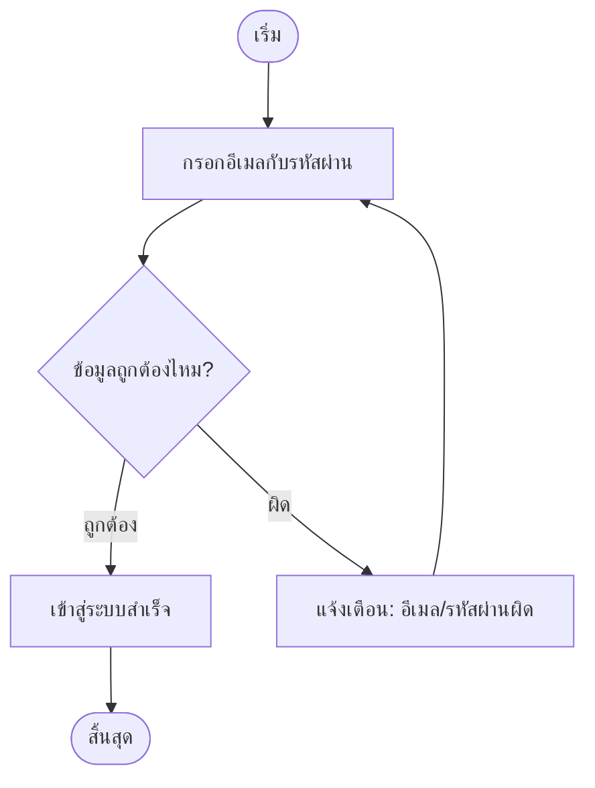
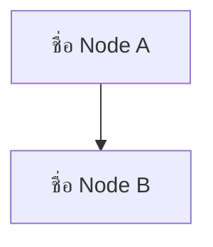
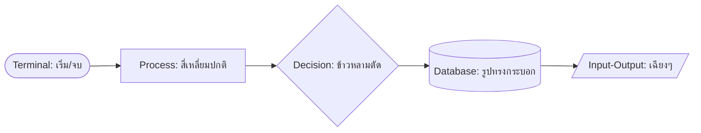
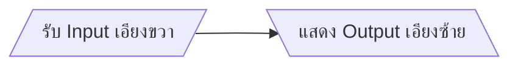
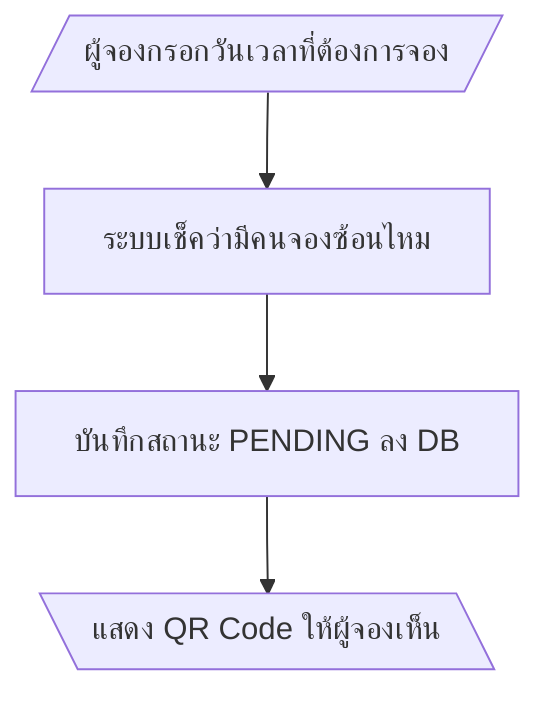
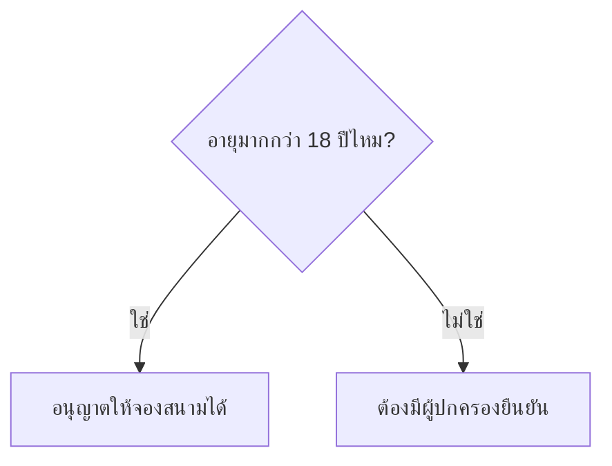
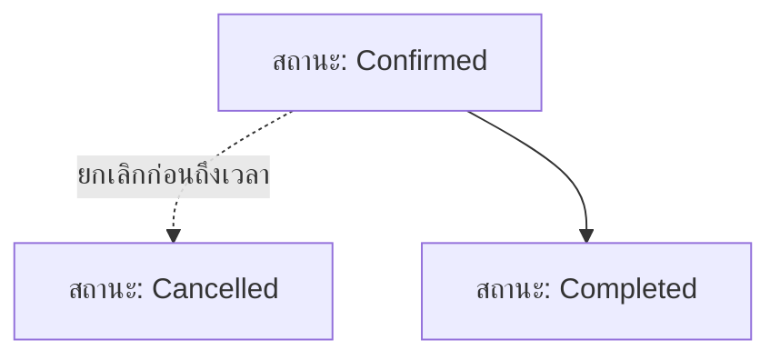
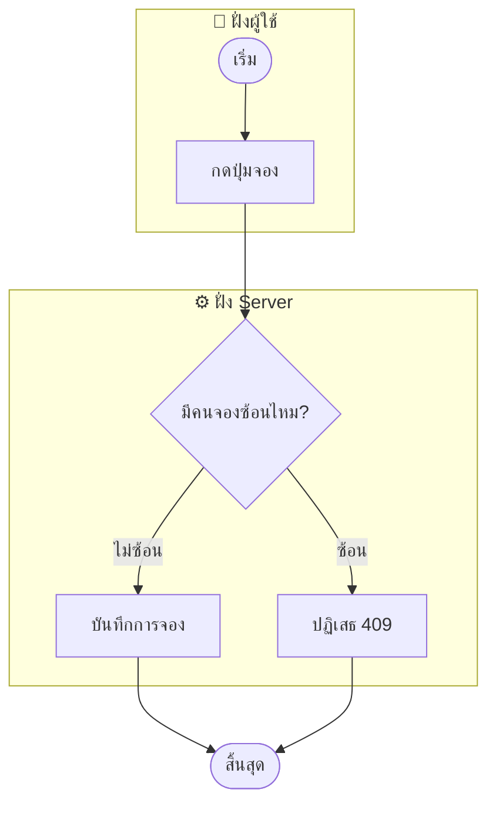
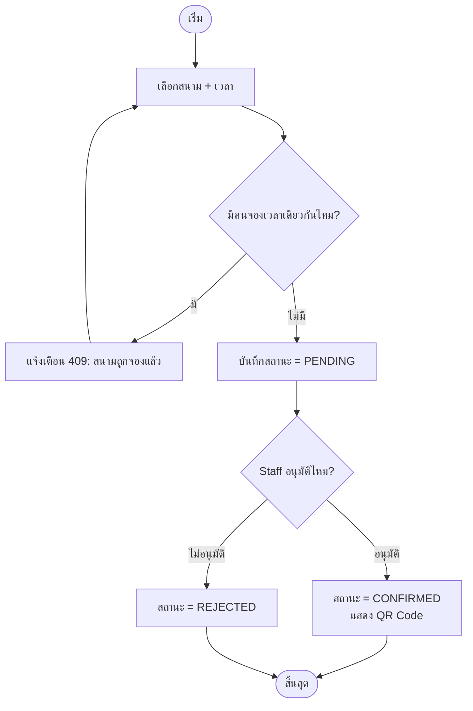

# คู่มือเรียน Flowchart แบบเข้าใจง่าย (ด้วย Mermaid)

เอกสารนี้สอนวิธี "อ่าน" และ "เขียน" Flowchart ตั้งแต่พื้นฐาน โดยใช้ตัวอย่างจริงจากโปรเจค UniPlay (ดู `plan.md` หัวข้อ 4) ประกอบ

---

## 1. Flowchart คืออะไร ทำไมต้องใช้

**Flowchart (แผนภาพลำดับขั้นตอน)** คือรูปภาพที่แสดง "ทำอะไรก่อน-หลัง" และ "ถ้าเงื่อนไข A เป็นจริง/เท็จ จะไปทางไหน" — ใช้แทนคำอธิบายยาวๆ ให้เห็นภาพเดียวเข้าใจทั้ง flow

**ทำไมโปรแกรมเมอร์ต้องใช้:**
- ก่อนเขียนโค้ด ช่วยให้เห็น edge case ที่อาจตกหล่น (เช่น "ถ้าจองซ้ำจะเกิดอะไร")
- ใช้คุยกับคนที่ไม่ใช่โปรแกรมเมอร์ (PM, ลูกค้า) ให้เข้าใจ flow ตรงกัน
- เก็บไว้เป็นเอกสารอ้างอิง ไม่ต้องอ่านโค้ดทั้งหมดถึงจะเข้าใจ flow

---

## 2. สัญลักษณ์พื้นฐาน 5 ตัวที่ต้องรู้

| สัญลักษณ์ | รูปร่าง | ความหมาย | ตัวอย่าง |
|---|---|---|---|
| **Terminal** (เริ่ม/จบ) | วงรี `( )` | จุดเริ่มต้นหรือจุดสิ้นสุดของ flow | "เริ่ม", "สิ้นสุด" |
| **Process** (การกระทำ) | สี่เหลี่ยม `[ ]` | ขั้นตอนหนึ่งที่ระบบทำ | "บันทึกข้อมูลลง DB" |
| **Decision** (จุดตัดสินใจ) | สี่เหลี่ยมข้าวหลามตัด `{ }` | จุดที่ต้องแยกทางตามเงื่อนไข (มักตอบแค่ ใช่/ไม่ใช่) | "จองสำเร็จไหม?" |
| **Input/Output** (รับ-แสดงข้อมูล) | สี่เหลี่ยม**เฉียงๆ** `[/ /]` | จุดที่ระบบรับข้อมูลจากคน หรือแสดงผลให้คนเห็น | "กรอกอีเมล/รหัสผ่าน" |
| **Arrow** (ลูกศร) | เส้น `-->` | บอกทิศทาง "ทำอันนี้ก่อน แล้วไปอันนี้ต่อ" | |

**กฎง่ายๆ ที่ต้องจำ:** เห็นข้าวหลามตัด (Decision) ต้องมีลูกศรออกอย่างน้อย 2 เส้นเสมอ (อย่างน้อยต้องมีทาง "ใช่" กับ "ไม่ใช่") ถ้ามีเส้นออกทางเดียวแสดงว่าใช้สัญลักษณ์ผิด ควรใช้ Process แทน

---

## 3. อ่าน Flowchart ง่ายๆ ตัวอย่างแรก

**วิธีอ่าน:** เริ่มที่ `A` (วงรี) → ไป `B` (กรอกข้อมูล) → ไปถึง `C` (จุดตัดสินใจ) → ถ้า "ถูกต้อง" ไป `D` แล้วจบที่ `F` / ถ้า "ผิด" ไป `E` แล้ว**วนกลับไปที่ `B`** ให้กรอกใหม่ — สังเกตว่า flowchart วนกลับได้ (loop) ไม่ต้องเดินหน้าทางเดียวเสมอ

---

## 4. โครงสร้างโค้ด Mermaid แบบละเอียด

แยกส่วนได้ดังนี้:

| ส่วน | ความหมาย |
|---|---|
| `flowchart TD` | ประกาศว่าเป็น flowchart ทิศทางบนลงล่าง (Top-Down) |
| `A`, `B` | **ID** ของ node (ต้องไม่มีเว้นวรรค ใช้เชื่อมเส้นได้) |
| `[ชื่อ Node A]` | **ข้อความที่แสดง** ในกล่อง (คนละส่วนกับ ID) |
| `-->` | ลูกศรจาก A ไป B |

**ทิศทางที่เลือกได้:**
- `TD` หรือ `TB` = บนลงล่าง (Top-Down/Top-Bottom) — ใช้บ่อยสุด เหมาะกับ flow ที่มีขั้นตอนไม่มาก
- `LR` = ซ้ายไปขวา (Left-Right) — เหมาะกับ flow ยาวๆ ที่อยากให้ดูกว้างแทนสูง

---

## 5. รูปร่าง Node ที่ใช้บ่อย

จำจากวงเล็บที่ล้อม node:
- `( )` วงเล็บกลม 1 ชั้น = วงรี (Terminal)
- `[ ]` วงเล็บเหลี่ยม = สี่เหลี่ยมปกติ (Process)
- `{ }` วงเล็บปีกกา = ข้าวหลามตัด (Decision)
- `[( )]` วงเล็บเหลี่ยมซ้อนวงกลม = รูปทรงกระบอก (มักใช้แทน Database)
- `[/ /]` หรือ `[\ \]` เครื่องหมายทับเอียง = **สี่เหลี่ยมด้านขนานเอียง (Parallelogram)** ใช้แทน **Input/Output** เช่น "รับข้อมูลจาก user", "แสดงผลลัพธ์ให้ user เห็น"

**ตัวอย่างรูปเฉียง (Parallelogram) เทียบทิศทาง:**

- `[/ข้อความ/]` = เอียงขวา (มักใช้แทน**รับข้อมูลเข้า** เช่น กรอกฟอร์ม, สแกน QR)
- `[\ข้อความ\]` = เอียงซ้าย (มักใช้แทน**แสดงผลออก** เช่น แสดงผลลัพธ์, พิมพ์ใบเสร็จ)
- ใช้แบบไหนก็ได้ ไม่มีกฎบังคับตายตัวว่าเอียงไหนคือ Input/Output แน่นอน — ทีมส่วนใหญ่เลือกทิศทางเดียวแล้วใช้ให้เหมือนกันทั้งเอกสารเพื่อความสม่ำเสมอ

### ใช้ Input/Output (เฉียงๆ) ตอนไหน ไม่ใช้ Process (สี่เหลี่ยมปกติ)?

หลักแยกง่ายๆ: **ดูว่าใครเป็นคนทำ**

- **Process (สี่เหลี่ยมปกติ):** ระบบทำเองข้างในทั้งหมด ไม่มีคนเข้ามายุ่งตรงจุดนี้ เช่น "บันทึกลง DB", "เช็ค overlap", "generate QR Code"
- **Input/Output (เฉียงๆ):** ข้อมูล**ข้ามเส้นแบ่งระหว่างระบบกับคน** — คนพิมพ์/กด/สแกนอะไรเข้ามา (Input) หรือระบบเอาอะไรไปโชว์ให้คนเห็น (Output)

**เทียบให้เห็นภาพจาก flow การจองสนามจริง:**

- `A` และ `D` ใช้เฉียงๆ เพราะเป็นจุดที่ **คนกับระบบคุยกัน** (คนกรอกข้อมูล / คนเห็นผลลัพธ์)
- `B` และ `C` ใช้สี่เหลี่ยมปกติ เพราะเป็นสิ่งที่ **ระบบทำเองล้วนๆ** ไม่มีคนเห็นหรือเข้ามาเกี่ยวข้องตรงจุดนั้น

**เทคนิคจำง่ายๆ:** ถ้าประโยคขั้นตอนนั้นมีคำว่า "กรอก", "เลือก", "สแกน", "กด" (คนเป็นคนทำ) หรือ "แสดง", "โชว์" (ให้คนดู) → มีโอกาสสูงว่าควรใช้เฉียงๆ ถ้าประโยคเป็น "บันทึก", "ตรวจสอบ", "คำนวณ", "อัปเดต" (ระบบทำเอง) → ใช้สี่เหลี่ยมปกติ

**ข้อควรรู้:** หลาย flowchart (รวมถึง flowchart ของ UniPlay ใน `plan.md`) เลือก**ใช้สี่เหลี่ยมปกติแทนทุกอย่างไปเลย** ไม่แยก Input/Output ออกมาเป็นรูปเฉียง เพราะทำให้ diagram เรียบง่ายกว่า อ่านเร็วกว่า — การใช้เฉียงๆ เป็น**ทางเลือก**ที่ช่วยให้ diagram สื่อความหมายละเอียดขึ้น ไม่ใช่กฎบังคับ เลือกใช้ตอนที่อยากเน้นให้เห็นชัดๆ ว่า "จุดนี้แหละคือจุดที่มีคนเข้ามาเกี่ยวข้อง"

---

## 6. ใส่ข้อความบนลูกศร (บอกว่าทางไหนคือ "เงื่อนไขอะไร")

ไวยากรณ์: `A -->|ข้อความ| B` — ข้อความจะไปแสดงอยู่**บนเส้นลูกศร** ระหว่าง A กับ B ใช้บอกว่า "ถ้าเงื่อนไขนี้เป็นจริง ให้ไปทางนี้"

**เทคนิคขึ้นบรรทัดใหม่ในกล่อง/บนเส้น:** ใช้ ` ` เช่น `A[บรรทัดที่ 1 บรรทัดที่ 2]` — มีประโยชน์มากเวลาข้อความยาว ทำให้กล่องไม่กว้างเกินไป

---

## 7. เส้นประ = ทางเลือกที่ไม่ใช่ flow หลัก

- `-->` เส้นทึบ = ทางที่เป็น flow หลัก/ปกติ
- `-.->` เส้นประ = ทางเลือกเสริม, exception, หรือ path ที่ไม่ได้เกิดขึ้นบ่อย (เช่น การยกเลิก)

ใช้เส้นประช่วยให้คนอ่านแยกออกทันทีว่า "อันนี้คือ flow หลักที่ต้องอ่านก่อน" กับ "อันนี้คือกรณีพิเศษ"

---

## 8. จัดกลุ่ม Node ด้วย `subgraph` (สำคัญมากสำหรับระบบที่มีหลายฝ่าย)

เวลา flow เกี่ยวข้องกับคนละระบบ/คนละฝ่าย (เช่น ฝั่ง User ทำอะไร, ฝั่ง Backend ทำอะไร) ให้ใช้ `subgraph` แบ่งเป็น "กรอบ" แยกกัน จะอ่านง่ายขึ้นมาก:

**จุดสำคัญ:** node ที่ต่างกรอบกัน (เช่น `B` อยู่ใน `User`, `C` อยู่ใน `Server`) ยัง**ลากเส้นเชื่อมกันได้ปกติ** เขียนไว้นอก `subgraph` ก็ได้ (บรรทัด `B --> C` ด้านล่าง) — mermaid จะวาดเส้นลอดผ่านกรอบให้เอง

ตัวอย่างจริงในโปรเจค UniPlay ใช้เทคนิคนี้แบ่งเป็น 4 กรอบ: Mobile App (ผู้จอง), Mobile App (Staff), Backend, Web Admin Panel — ดูได้ที่ `plan.md` หัวข้อ 4

---

## 9. ตัวอย่างจริงแบบง่าย: Flow การจองสนาม (ย่อจาก UniPlay)

ลองไล่อ่านตามลูกศรจากบนลงล่างดู — นี่คือหลักการเดียวกันกับ flowchart เต็มรูปแบบใน `plan.md` แค่ตัดรายละเอียดเรื่อง Cron Job/No-Show/Check-in ออกให้เห็นภาพรวมง่ายๆ ก่อน

---

## 10. เช็คลิสต์ก่อนส่ง Flowchart ให้คนอื่นอ่าน

- [ ] มีจุด **เริ่ม** และ **สิ้นสุด** ชัดเจน (ใช้วงรี)
- [ ] ทุก Decision (ข้าวหลามตัด) มีลูกศรออกอย่างน้อย 2 เส้น พร้อม label บอกเงื่อนไข
- [ ] ทุก path ที่แตกออกจาก Decision ในที่สุดต้องไปถึงจุดสิ้นสุด (ไม่มีทางตันที่ไม่มีลูกศรออก ยกเว้นตั้งใจให้เป็นจุดจบ)
- [ ] ถ้า flow เกี่ยวข้องหลายฝ่าย ใช้ `subgraph` แบ่งให้อ่านง่าย
- [ ] ใช้เส้นประ (`-.->`) แยก path ปกติกับ path พิเศษ/exception
- [ ] ข้อความในกล่องสั้น กระชับ ถ้ายาวให้ใช้ ` ` ขึ้นบรรทัดใหม่แทนเขียนยาวบรรทัดเดียว

--
