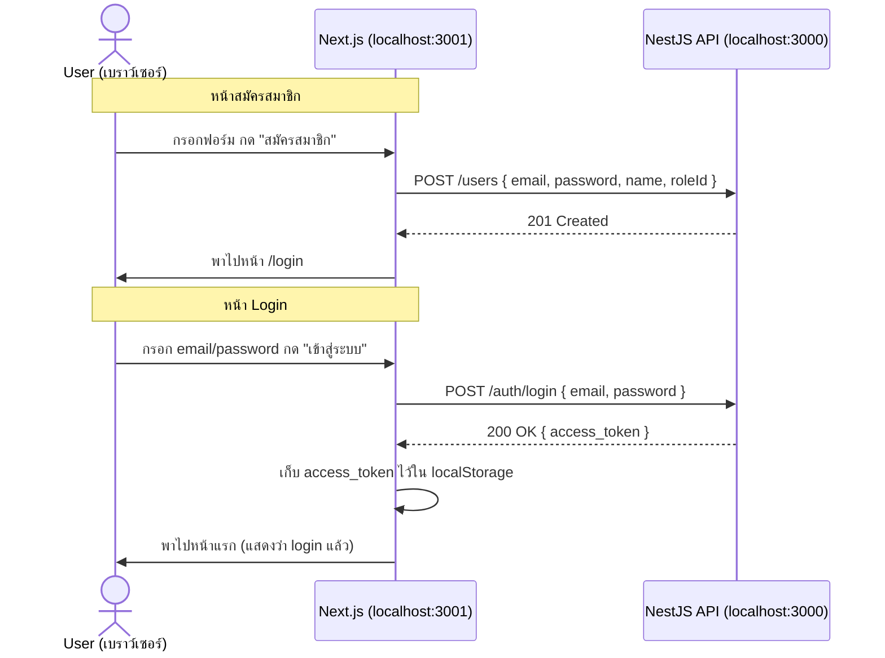

# คู่มือสร้าง Frontend (Next.js) หน้า Login + สมัครสมาชิก แบบ Step-by-Step

เอกสารนี้สอนสร้าง **Frontend ด้วย Next.js** (ตามที่กำหนดไว้ใน `plan.md` หัวข้อ Web Admin Panel) เชื่อมกับ backend (`apps/api`) ที่ทำไว้แล้ว — ทุกคำสั่ง/โค้ดในนี้ติดตั้งและทดสอบผ่านจริงแล้วใน `frontend/apps` ก่อนเขียนคู่มือ

## โฟลเดอร์ไหนทำอะไร

| โฟลเดอร์ | สถานะ | ใช้ทำอะไร |
|---|---|---|
| **`frontend/apps`** | ทำหน้า Login + สมัครสมาชิกเสร็จแล้ว เชื่อม `apps/api` จริง | **เฉลย/ของจริงที่ใช้งาน** — เทียบผลลัพธ์/โค้ดได้เลย |
| **`frontend/ex`** | scaffold เปล่าๆ (แค่ `create-next-app` default) | **ที่ฝึกของนักเรียน** — ทำตามคู่มือนี้สร้างทุกไฟล์เอง |

> คู่มือนี้ต้องมี backend (`apps/api`) รันอยู่แล้วและทำ `AUTH_GUIDE.md` เสร็จแล้ว (มี `POST /auth/login` และ `POST /users` ที่ `@Public()`) — ถ้ายังไม่ได้ทำ ให้ไปทำ `AUTH_GUIDE.md` ก่อน

---

## 0. ภาพรวม: Frontend คุยกับ Backend ยังไง



**จุดสำคัญ:** Next.js (frontend) กับ NestJS (backend) เป็น **คนละแอปคนละพอร์ตกัน** (frontend `:3001`, backend `:3000`) — เบราว์เซอร์ที่เปิดหน้า Next.js ต้องยิง request ข้ามพอร์ตไปหา backend ทุกครั้งที่ login/สมัครสมาชิก ซึ่งเบราว์เซอร์จะบล็อกไว้โดย default ด้วยกฎ **CORS** (ดูหัวข้อ 3) ถ้า backend ไม่อนุญาตไว้ก่อน

---

## 1. สร้างโปรเจค Next.js

```bash
cd frontend
npx create-next-app@latest apps --typescript --tailwind --eslint --app --src-dir --import-alias "@/*" --use-npm --no-turbopack
```

| Flag | ความหมาย |
|---|---|
| `--typescript` | ใช้ TypeScript (ตรงกับ `apps/api` ที่เป็น TypeScript อยู่แล้ว) |
| `--tailwind` | ติดตั้ง Tailwind CSS ให้พร้อมใช้ (ตามที่ `plan.md` กำหนด) |
| `--eslint` | ติดตั้ง ESLint พื้นฐาน |
| `--app` | ใช้ App Router (โฟลเดอร์ `src/app/`) ตามที่ `plan.md` ระบุ ไม่ใช่ Pages Router แบบเก่า |
| `--src-dir` | เก็บโค้ดไว้ใน `src/` แยกจาก config ไฟล์ที่ root |
| `--import-alias "@/*"` | ให้ import ด้วย `@/lib/...` แทน relative path ยาวๆ แบบ `../../lib/...` |
| `--use-npm` | บังคับใช้ `npm` (ให้ตรงกับ `apps/api` ที่ใช้ `npm` เหมือนกัน) |
| `--no-turbopack` | ปิด Turbopack (ยังใหม่มาก ใช้ default bundler ที่เสถียรกว่าสำหรับคู่มือนี้) |

รันคำสั่งนี้จากโฟลเดอร์ `frontend/` ที่ root ของ repo (สร้างโฟลเดอร์นี้ก่อนถ้ายังไม่มี) จะได้ `frontend/apps` — ระหว่างรัน CLI จะถามหลายคำถาม ตอบตามค่าที่ flag กำหนดไว้ได้เลย (หรือ flag ครบแล้วจะไม่ถามซ้ำ)

> **ถ้าทำตามคู่มือนี้ในโฟลเดอร์ `frontend/ex` (ที่ฝึกของนักเรียน): ข้ามขั้นตอนนี้ไปเลย** เพราะ `frontend/ex` มี scaffold เปล่าๆ เตรียมไว้ให้แล้ว (สร้างล่วงหน้าด้วยคำสั่งเดียวกันนี้ แค่เปลี่ยนชื่อท้ายคำสั่งจาก `apps` เป็น `ex`) ให้เริ่มทำตามตั้งแต่หัวข้อ 2 เป็นต้นไปในโฟลเดอร์นั้นได้ทันที — คำสั่งนี้จำเป็นเฉพาะตอนสร้างโปรเจคใหม่ตั้งแต่ศูนย์เท่านั้น (เช่น ตอนสร้าง `frontend/apps` ครั้งแรก หรือถ้าจะสาธิตให้นักเรียนดูวิธีเริ่มโปรเจคจริงๆ ตั้งแต่ต้น) **ห้ามรันซ้ำใส่โฟลเดอร์ที่มีไฟล์อยู่แล้ว** เพราะ `create-next-app` จะปฏิเสธทันทีถ้าเจอไฟล์เดิมค้างอยู่ในโฟลเดอร์ปลายทาง — ถ้าต้องการรันจริงๆ (ลบของเดิมทิ้งแล้วเริ่มใหม่) ต้องลบโฟลเดอร์ปลายทางทิ้งก่อน

**เช็คว่าไม่มีช่องโหว่ความปลอดภัยหลงเหลือ:**
```bash
npm audit
```
ควรขึ้น `found 0 vulnerabilities`

### 1.1 เทคนิคช่วยพิมพ์โครงหน้าใหม่เร็วขึ้น (ไม่บังคับ)

Next.js ไม่มี CLI สำหรับสร้างหน้าใหม่ (ต่างจาก `nest g` ฝั่ง backend — ดู `AUTH_GUIDE.md`) ต้องสร้างไฟล์ `page.tsx` เปล่าๆ เองเสมอ ซึ่งถ้าปล่อยว่างไว้จะ **error ทันที** เพราะ Next.js บังคับให้ทุกไฟล์ `page.tsx` ต้องมี `export default` เป็น React component

ติดตั้ง VS Code extension ชื่อ **"ES7+ React/Redux/React-Native Snippets"** แล้วในไฟล์ `.tsx` เปล่าๆ พิมพ์:
```
rafce
```
แล้วกด `Tab` — จะได้โครง component ขั้นต่ำขึ้นมาอัตโนมัติ (ตั้งชื่อ function ตามชื่อไฟล์ให้เลย):
```typescript
import React from 'react'

const page = () => {
  return (
    <div>page</div>
  )
}

export default page
```

**ข้อควรรู้:** โครงจาก `rafce` เป็น component เปล่าๆ ธรรมดา **ยังไม่มี** `'use client'`, `useState`, event handler ฯลฯ ที่หน้า Login/สมัครสมาชิกในคู่มือนี้ต้องใช้ (ดูหัวข้อ 8-9) — snippet นี้แค่ช่วยลดพิมพ์โครง `export default function` ซ้ำๆ ทุกไฟล์เท่านั้น ส่วนโค้ดจริงข้างในยังต้องเขียน/copy ตามคู่มือต่อเอง

---

## 2. โครงสร้างไฟล์ที่จะสร้างเพิ่ม

```
src/
├── app/
│   ├── layout.tsx           # (มีอยู่แล้วจาก scaffold) แก้แค่ title
│   ├── page.tsx             # (มีอยู่แล้วจาก scaffold) แก้เป็นหน้า dashboard ง่ายๆ
│   ├── login/
│   │   └── page.tsx         # หน้า Login
│   └── users/
│       └── new/
│           └── page.tsx     # หน้าสมัครสมาชิก (เรียก POST /users)
└── lib/
    ├── api.ts                # ฟังก์ชันเรียก backend (login, createUser)
    ├── token.ts               # เก็บ/อ่าน/ลบ access_token ใน localStorage
    └── roles.ts               # รายชื่อ role แบบ hardcode (ดูหมายเหตุหัวข้อ 6)
```

---

## 3. เปิด CORS ที่ backend (ต้องทำก่อน ไม่งั้นเรียก API จาก browser ไม่ได้)

แก้ `apps/api/src/main.ts`:

```typescript
async function bootstrap() {
  const app = await NestFactory.create(AppModule);
  /* -------------------- เพิ่มบรรทัดนี้ -------------------- */
  app.enableCors({ origin: process.env.FRONTEND_URL ?? 'http://localhost:3001' });
  /* --------------------------------------------------------- */
  app.useGlobalPipes(new ValidationPipe({ whitelist: true, transform: true }));
  // ... ส่วนที่เหลือเหมือนเดิม
```

และเพิ่มใน `apps/api/.env.example` (เอาไปใส่ใน `.env` จริงด้วยถ้าอยากเปลี่ยน URL):
```env
FRONTEND_URL="http://localhost:3001"
```

**อธิบาย:** ปกติเบราว์เซอร์จะ**บล็อก** request ข้าม origin (คนละ protocol/domain/port กัน — ที่นี่คือคนละพอร์ต `3001` vs `3000`) เพื่อความปลอดภัย (กันเว็บอื่นแอบยิง request ไปขโมยข้อมูลจากเว็บที่เรา login ไว้) เรียกกฎนี้ว่า **CORS (Cross-Origin Resource Sharing)** — `app.enableCors({ origin: '...' })` คือการที่ backend **อนุญาตอย่างชัดเจน** ว่า origin นี้ (frontend ของเราเอง) ยิง request เข้ามาได้ โดยแนบ header `Access-Control-Allow-Origin` กลับไปในทุก response ให้เบราว์เซอร์เห็นว่าอนุญาตแล้ว

**เช็คว่า CORS เปิดถูกจริง:**
```bash
curl -i -X OPTIONS http://localhost:3000/auth/login \
  -H "Origin: http://localhost:3001" \
  -H "Access-Control-Request-Method: POST"
```
ควรเห็น header `Access-Control-Allow-Origin: http://localhost:3001` กลับมา

---

## 4. ตั้งค่า API URL (`.env.local`)

สร้างไฟล์ `.env.local` ที่ root ของ `frontend/apps`:

```env
NEXT_PUBLIC_API_URL="http://localhost:3000"
```

และสร้าง `.env.local.example` (ไฟล์เดียวกันแต่ไม่มีค่าลับ — commit ขึ้น git ได้ ต่างจาก `.env.local` ที่ไม่ควร commit):
```env
NEXT_PUBLIC_API_URL="http://localhost:3000"
```

**ทำไมต้องมี prefix `NEXT_PUBLIC_`:** Next.js จะ**เอาไปฝังในโค้ด JS ที่ส่งไปให้เบราว์เซอร์** เฉพาะ env variable ที่ขึ้นต้นด้วย `NEXT_PUBLIC_` เท่านั้น (เพราะ URL ของ API ไม่ใช่ความลับ ต้องให้ฝั่ง client รู้ด้วยว่าจะยิง request ไปที่ไหน) — env ตัวอื่นที่ไม่มี prefix นี้จะถูกใช้ได้แค่ฝั่ง server เท่านั้น

**อย่าลืมเพิ่ม `.env.local.example` ให้ไม่ถูก `.gitignore` บล็อก** เปิด `.gitignore` แล้วแก้บรรทัด:
```
.env*
```
เป็น:
```
.env*
!.env.local.example
```

---

## 5. สร้าง `lib/api.ts` — ฟังก์ชันเรียก backend

```typescript
// src/lib/api.ts
const API_URL = process.env.NEXT_PUBLIC_API_URL;

export class ApiError extends Error {
  constructor(
    message: string,
    public status: number,
  ) {
    super(message);
  }
}

async function parseErrorMessage(res: Response): Promise<string> {
  const body = await res.json().catch(() => null);
  if (!body?.message) return `Request failed with status ${res.status}`;
  return Array.isArray(body.message) ? body.message.join(', ') : body.message;
}

export type LoginPayload = {
  email: string;
  password: string;
};

export type LoginResponse = {
  access_token: string;
};

export async function login(payload: LoginPayload): Promise<LoginResponse> {
  const res = await fetch(`${API_URL}/auth/login`, {
    method: 'POST',
    headers: { 'Content-Type': 'application/json' },
    body: JSON.stringify(payload),
  });

  if (!res.ok) throw new ApiError(await parseErrorMessage(res), res.status);
  return res.json();
}

export type CreateUserPayload = {
  email: string;
  password: string;
  name: string;
  roleId: string;
};

export type User = {
  id: string;
  email: string;
  name: string;
  roleId: string;
  isActive: boolean;
  createdAt: string;
  updatedAt: string;
};

export async function createUser(payload: CreateUserPayload): Promise<User> {
  const res = await fetch(`${API_URL}/users`, {
    method: 'POST',
    headers: { 'Content-Type': 'application/json' },
    body: JSON.stringify(payload),
  });

  if (!res.ok) throw new ApiError(await parseErrorMessage(res), res.status);
  return res.json();
}
```

**อธิบาย:**
- **`ApiError`** — custom error class ที่เก็บ `status` (HTTP status code) ติดมาด้วย เพื่อให้หน้าที่เรียกใช้ (component) แยกแยะได้ว่า error เกิดจากอะไร (เช่น `401` = password ผิด, `400` = validation ไม่ผ่าน) ไม่ใช่แค่ error message ล้วนๆ
- **`parseErrorMessage()`** — backend (`ValidationPipe` ใน `apps/api`) ส่ง error กลับมาเป็น `{ message: [...] }` (array ของ string หลายข้อผิดพลาด) หรือ `{ message: "..." }` (string เดียว) ก็ได้ ฟังก์ชันนี้รวมให้เป็น string เดียวเสมอ เอาไปโชว์ในฟอร์มได้ตรงๆ
- **`login()` / `createUser()`** — ห่อ `fetch()` มาตรฐานของ browser ไว้ให้เรียกง่ายขึ้น ไม่ต้องเขียน `fetch(...)` ยาวๆ ซ้ำทุกหน้า — ถ้า response ไม่ใช่ `2xx` (`res.ok === false`) จะ throw `ApiError` ออกไปทันที ไม่ต้อง return ค่า error แยกให้ผู้เรียกต้องเช็คเอง

---

## 6. สร้าง `lib/roles.ts` — รายชื่อ role (hardcode ชั่วคราว)

```typescript
// src/lib/roles.ts
// ยังไม่มี endpoint GET /roles ในฝั่ง backend จึง hardcode รายชื่อ role ไว้ที่นี่ก่อน
// (ต้อง sync มือกับ seed data ใน schema-draft.sql ถ้า role เปลี่ยน)
export const ROLES = [
  { id: 'a541ccca-c9e0-4825-adfb-f71e1de40676', name: 'STUDENT' },
  { id: '385a0cc6-2339-4f3e-b2d1-edbd8a27f41b', name: 'LECTURER' },
  { id: '8176650d-f83d-4ca2-9ec8-fcf1f1f72b46', name: 'STAFF' },
  { id: '866005f6-ccaf-4ec7-8601-d3797c99a88e', name: 'ADMIN' },
];
```

**ทำไม hardcode:** หน้าสมัครสมาชิกต้องให้ผู้ใช้เลือก role แต่ backend **ยังไม่มี** endpoint `GET /roles` ให้ query รายชื่อ role จริง (มีแต่ `role` table ใน database) — เอา `id` จาก table `role` มาใส่ตรงๆ ไปก่อนเป็นทางลัด **ข้อเสียที่ต้องรู้:** ถ้า role ใน database เปลี่ยน (เพิ่ม/ลบ/id เปลี่ยน) ต้องมาแก้ไฟล์นี้มือ — พอมี RBAC Module ตาม Roadmap ใน `plan.md` แล้วค่อยเปลี่ยนมาดึงจาก endpoint จริงทีหลัง

เช็ค `id` จริงในเครื่องตัวเองด้วย:
```bash
docker exec uniplay-postgres psql -U uniplay -d uniplay -c 'SELECT id, name FROM role;'
```

---

## 7. สร้าง `lib/token.ts` — เก็บ token ไว้ที่ไหน

```typescript
// src/lib/token.ts
const TOKEN_KEY = 'access_token';

export function saveToken(token: string) {
  localStorage.setItem(TOKEN_KEY, token);
}

export function getToken(): string | null {
  if (typeof window === 'undefined') return null;
  return localStorage.getItem(TOKEN_KEY);
}

export function clearToken() {
  localStorage.removeItem(TOKEN_KEY);
}
```

**ทำไมต้องเช็ค `typeof window === 'undefined'` ใน `getToken()`:** Next.js render โค้ดได้ทั้งฝั่ง **server** (ตอน build/SSR ไม่มี `window`/`localStorage` เพราะไม่ใช่เบราว์เซอร์) และฝั่ง **client** (เบราว์เซอร์จริง มี `localStorage`) — ถ้าเรียก `localStorage` ตรงๆ โดยไม่เช็คก่อน จะ error ทันทีเวลาโค้ดถูกรันฝั่ง server

**หมายเหตุเรื่องความปลอดภัย (สำคัญ อย่าข้าม):** คู่มือนี้เก็บ `access_token` ไว้ใน `localStorage` เพราะ**เขียนง่ายที่สุดสำหรับการเรียนรู้** แต่ `localStorage` เข้าถึงได้จาก JavaScript ทุกตัวในหน้าเว็บ (รวมถึงโค้ดอันตรายที่หลุดเข้ามาผ่าน XSS) — โปรเจคจริงที่เข้มงวดเรื่องความปลอดภัยมักเก็บ token ไว้ใน **httpOnly cookie** แทน (JavaScript อ่านไม่ได้เลย ต้องให้ browser ส่งอัตโนมัติ) ซึ่งซับซ้อนกว่านี้ — บันทึกไว้เป็นเรื่องที่ควรกลับมาปรับก่อนขึ้น production จริง

---

## 8. สร้างหน้า Login (`app/login/page.tsx`)

```typescript
// src/app/login/page.tsx
'use client';

import { useState, type FormEvent } from 'react';
import { useRouter } from 'next/navigation';
import { login, ApiError } from '@/lib/api';
import { saveToken } from '@/lib/token';

export default function LoginPage() {
  const router = useRouter();
  const [email, setEmail] = useState('');
  const [password, setPassword] = useState('');
  const [error, setError] = useState<string | null>(null);
  const [loading, setLoading] = useState(false);

  async function handleSubmit(e: FormEvent) {
    e.preventDefault();
    setError(null);
    setLoading(true);

    try {
      const { access_token } = await login({ email, password });
      saveToken(access_token);
      router.push('/');
    } catch (err) {
      setError(err instanceof ApiError ? err.message : 'เข้าสู่ระบบไม่สำเร็จ');
    } finally {
      setLoading(false);
    }
  }

  return (
    <main className="flex min-h-screen items-center justify-center bg-gray-50 px-4">
      <form
        onSubmit={handleSubmit}
        className="w-full max-w-sm rounded-lg border border-gray-200 bg-white p-8 shadow-sm"
      >
        <h1 className="mb-6 text-2xl font-semibold text-gray-900">เข้าสู่ระบบ</h1>

        <label className="mb-1 block text-sm font-medium text-gray-700" htmlFor="email">
          Email
        </label>
        <input
          id="email"
          type="email"
          required
          value={email}
          onChange={(e) => setEmail(e.target.value)}
          className="mb-4 w-full rounded-md border border-gray-300 bg-white px-3 py-2 text-sm text-gray-900 placeholder:text-gray-400 focus:border-blue-500 focus:outline-none"
          placeholder="student1@uniplay.test"
        />

        <label className="mb-1 block text-sm font-medium text-gray-700" htmlFor="password">
          Password
        </label>
        <input
          id="password"
          type="password"
          required
          value={password}
          onChange={(e) => setPassword(e.target.value)}
          className="mb-6 w-full rounded-md border border-gray-300 bg-white px-3 py-2 text-sm text-gray-900 focus:border-blue-500 focus:outline-none"
          placeholder="********"
        />

        {error && <p className="mb-4 text-sm text-red-600">{error}</p>}

        <button
          type="submit"
          disabled={loading}
          className="w-full rounded-md bg-blue-600 px-4 py-2 text-sm font-medium text-white hover:bg-blue-700 disabled:opacity-50"
        >
          {loading ? 'กำลังเข้าสู่ระบบ...' : 'เข้าสู่ระบบ'}
        </button>

        <p className="mt-4 text-center text-sm text-gray-500">
          ยังไม่มีบัญชี?{' '}
          <a href="/users/new" className="text-blue-600 hover:underline">
            สมัครสมาชิก
          </a>
        </p>
      </form>
    </main>
  );
}
```

**อธิบายทีละส่วนที่สำคัญ:**
- **`'use client'`** — บอก Next.js ว่าไฟล์นี้ต้องรันในเบราว์เซอร์ (Client Component) ไม่ใช่ Server Component (default ของ App Router) — จำเป็นเพราะไฟล์นี้ใช้ `useState`, `onClick`, event handler ต่างๆ ซึ่งต้องมี JavaScript รันอยู่ในเบราว์เซอร์จริง (Server Component render เป็น HTML ธรรมดาแล้วจบ ไม่มี interactivity)
- **`useState`** — เก็บค่าที่พิมพ์ในฟอร์ม (`email`, `password`) และสถานะ (`error`, `loading`) ไว้ใน component แต่ละครั้งที่ค่าเปลี่ยน React จะ re-render หน้าให้ตรงกับค่าล่าสุด
- **`handleSubmit`** — เรียกตอนกด submit ฟอร์ม: เรียก `login()` จาก `lib/api.ts` → ถ้าสำเร็จ เก็บ token ด้วย `saveToken()` แล้วพาไปหน้าแรก (`router.push('/')`) → ถ้า error (เช่น password ผิด) โชว์ข้อความ error ให้เห็น
- **`e.preventDefault()`** — ฟอร์ม HTML ปกติพอกด submit จะ reload หน้าทั้งหน้าทันที (behavior ดั้งเดิมของเบราว์เซอร์) ต้องเรียกตัวนี้เพื่อบล็อกไว้ แล้วจัดการ submit ด้วย JavaScript (`fetch`) เองแทน
- **`useRouter()` + `router.push('/')`** — เปลี่ยนหน้าแบบ client-side (ไม่ reload ทั้งหน้า) ของ Next.js App Router
- **`bg-white text-gray-900` บน `<input>` ทุกตัว (สำคัญ อย่าลืมใส่):** ถ้าไม่ใส่ ตัวหนังสือที่พิมพ์ในฟอร์มจะ**มองไม่เห็น**บนเครื่องที่เปิด dark mode ไว้ — เพราะ `globals.css` (จาก scaffold) ตั้ง `body { color: var(--foreground) }` ไว้ที่ระดับ `<body>` และ `--foreground` เปลี่ยนเป็นสีเกือบขาว (`#ededed`) อัตโนมัติเมื่อ `prefers-color-scheme: dark` — `<input>` ไม่ได้กำหนดสีตัวเองจึง**สืบทอด**สีนี้มาจาก `<body>` ทำให้กลายเป็นตัวหนังสือสีเกือบขาวบนกล่อง input พื้นขาว (มองไม่เห็นตัวอักษรที่พิมพ์) การใส่ `bg-white text-gray-900` ตรงๆ ที่ `<input>` คือการบังคับสีให้คงที่ ไม่ขึ้นกับโหมดของเครื่องผู้ใช้

---

## 9. สร้างหน้าสมัครสมาชิก (`app/users/new/page.tsx`)

```typescript
// src/app/users/new/page.tsx
'use client';

import { useState, type FormEvent } from 'react';
import { useRouter } from 'next/navigation';
import { createUser, ApiError } from '@/lib/api';
import { ROLES } from '@/lib/roles';

export default function NewUserPage() {
  const router = useRouter();
  const [email, setEmail] = useState('');
  const [password, setPassword] = useState('');
  const [name, setName] = useState('');
  const [roleId, setRoleId] = useState(ROLES[0].id);
  const [error, setError] = useState<string | null>(null);
  const [loading, setLoading] = useState(false);

  async function handleSubmit(e: FormEvent) {
    e.preventDefault();
    setError(null);
    setLoading(true);

    try {
      await createUser({ email, password, name, roleId });
      router.push('/login');
    } catch (err) {
      setError(err instanceof ApiError ? err.message : 'สมัครสมาชิกไม่สำเร็จ');
    } finally {
      setLoading(false);
    }
  }

  return (
    <main className="flex min-h-screen items-center justify-center bg-gray-50 px-4">
      <form
        onSubmit={handleSubmit}
        className="w-full max-w-sm rounded-lg border border-gray-200 bg-white p-8 shadow-sm"
      >
        <h1 className="mb-6 text-2xl font-semibold text-gray-900">สมัครสมาชิก</h1>

        <label className="mb-1 block text-sm font-medium text-gray-700" htmlFor="name">
          ชื่อ
        </label>
        <input
          id="name"
          type="text"
          required
          value={name}
          onChange={(e) => setName(e.target.value)}
          className="mb-4 w-full rounded-md border border-gray-300 bg-white px-3 py-2 text-sm text-gray-900 placeholder:text-gray-400 focus:border-blue-500 focus:outline-none"
          placeholder="Somchai"
        />

        <label className="mb-1 block text-sm font-medium text-gray-700" htmlFor="email">
          Email
        </label>
        <input
          id="email"
          type="email"
          required
          value={email}
          onChange={(e) => setEmail(e.target.value)}
          className="mb-4 w-full rounded-md border border-gray-300 bg-white px-3 py-2 text-sm text-gray-900 placeholder:text-gray-400 focus:border-blue-500 focus:outline-none"
          placeholder="student1@uniplay.test"
        />

        <label className="mb-1 block text-sm font-medium text-gray-700" htmlFor="password">
          Password
        </label>
        <input
          id="password"
          type="password"
          required
          value={password}
          onChange={(e) => setPassword(e.target.value)}
          className="mb-4 w-full rounded-md border border-gray-300 bg-white px-3 py-2 text-sm text-gray-900 placeholder:text-gray-400 focus:border-blue-500 focus:outline-none"
          placeholder="********"
        />

        <label className="mb-1 block text-sm font-medium text-gray-700" htmlFor="roleId">
          บทบาท
        </label>
        <select
          id="roleId"
          value={roleId}
          onChange={(e) => setRoleId(e.target.value)}
          className="mb-6 w-full rounded-md border border-gray-300 bg-white px-3 py-2 text-sm text-gray-900 focus:border-blue-500 focus:outline-none"
        >
          {ROLES.map((role) => (
            <option key={role.id} value={role.id}>
              {role.name}
            </option>
          ))}
        </select>

        {error && <p className="mb-4 text-sm text-red-600">{error}</p>}

        <button
          type="submit"
          disabled={loading}
          className="w-full rounded-md bg-blue-600 px-4 py-2 text-sm font-medium text-white hover:bg-blue-700 disabled:opacity-50"
        >
          {loading ? 'กำลังสมัครสมาชิก...' : 'สมัครสมาชิก'}
        </button>

        <p className="mt-4 text-center text-sm text-gray-500">
          มีบัญชีแล้ว?{' '}
          <a href="/login" className="text-blue-600 hover:underline">
            เข้าสู่ระบบ
          </a>
        </p>
      </form>
    </main>
  );
}
```

**อธิบาย:** โครงสร้างเหมือนหน้า Login ทุกอย่าง ต่างกันที่:
- มี field เพิ่ม (`name`, `roleId`) ให้ตรงกับ `CreateUserDto` ของ backend (`apps/api/src/users/dto/create-user.dto.ts`)
- `<select>` แสดงตัวเลือก role จาก `ROLES` ที่ import มาจากหัวข้อ 6 — ค่าเริ่มต้นตั้งเป็น role แรกในลิสต์ (`ROLES[0].id`)
- สำเร็จแล้วพาไปหน้า `/login` (ไม่ใช่หน้าแรก) เพราะสมัครสมาชิกแล้วยังไม่มี token ต้อง login อีกทีก่อน

---

## 10. แก้หน้าแรก (`app/page.tsx`) ให้เช็คว่า login แล้วหรือยัง

```typescript
// src/app/page.tsx
'use client';

import { useEffect, useState } from 'react';
import { clearToken, getToken } from '@/lib/token';

export default function HomePage() {
  const [hasToken, setHasToken] = useState(false);

  useEffect(() => {
    setHasToken(!!getToken());
  }, []);

  function handleLogout() {
    clearToken();
    setHasToken(false);
  }

  return (
    <main className="flex min-h-screen flex-col items-center justify-center gap-6 bg-gray-50 px-4">
      <h1 className="text-2xl font-semibold text-gray-900">UniPlay Admin</h1>

      {hasToken ? (
        <>
          <p className="text-sm text-gray-600">เข้าสู่ระบบแล้ว (มี access_token เก็บอยู่)</p>
          <button
            onClick={handleLogout}
            className="rounded-md bg-gray-200 px-4 py-2 text-sm font-medium text-gray-800 hover:bg-gray-300"
          >
            ออกจากระบบ
          </button>
        </>
      ) : (
        <div className="flex gap-3">
          <a
            href="/login"
            className="rounded-md bg-blue-600 px-4 py-2 text-sm font-medium text-white hover:bg-blue-700"
          >
            เข้าสู่ระบบ
          </a>
          <a
            href="/users/new"
            className="rounded-md border border-gray-300 px-4 py-2 text-sm font-medium text-gray-700 hover:bg-gray-100"
          >
            สมัครสมาชิก
          </a>
        </div>
      )}
    </main>
  );
}
```

**ทำไมใช้ `useEffect` เช็ค token แทนเช็คตรงๆ ตอน render:** `getToken()` เรียก `localStorage` ซึ่งมีอยู่แค่ฝั่งเบราว์เซอร์ (ดูหัวข้อ 7) — ถ้าเช็คตรงๆ ตอน render ครั้งแรก (ที่อาจรันฝั่ง server ก่อน) จะได้ผลไม่ตรงกัน (server ไม่รู้จัก token ทำให้ render เป็น "ยังไม่ login" ก่อนเสมอ) `useEffect` การันตีว่าโค้ดข้างในรันหลังจากหน้าเว็บโหลดเสร็จในเบราว์เซอร์แล้วเท่านั้น (ค่าเริ่มต้น `hasToken = false` จะกระพริบเป็น `true` เร็วๆ ถ้ามี token จริง)

(ส่วน `title`/`description` ใน `src/app/layout.tsx` แก้เป็น `"UniPlay Admin"` ได้ตามชอบ ไม่ใช่จุดสำคัญของคู่มือนี้)

---

## 11. รันและทดสอบ

เปิด 2 terminal:

```bash
# Terminal 1: backend (ต้องมี Postgres รันอยู่ด้วย — ดู DATABASE_SETUP.md)
cd apps/api
npm run start:dev

# Terminal 2: frontend
cd frontend/apps
npm run dev -- -p 3001
```

**ทดสอบตามลำดับ:**
1. เปิด `http://localhost:3001/users/new` → กรอกฟอร์ม (เลือก role อะไรก็ได้) → กด "สมัครสมาชิก" → ควรพาไปหน้า `/login` อัตโนมัติ
2. ที่หน้า `/login` → กรอก email/password ที่สมัครไว้ในขั้นที่ 1 → กด "เข้าสู่ระบบ" → ควรพาไปหน้าแรก (`/`)
3. ที่หน้าแรก ควรเห็นข้อความ "เข้าสู่ระบบแล้ว" พร้อมปุ่ม "ออกจากระบบ"
4. เปิด DevTools ของเบราว์เซอร์ (F12) → tab **Application/Storage** → **Local Storage** → `http://localhost:3001` → ควรเห็น key `access_token` มีค่าเป็น JWT string ยาวๆ
5. ลองกรอก password ผิดที่หน้า login → ควรเห็นข้อความ error สีแดงใต้ฟอร์ม (ไม่ใช่หน้าเว็บ error/crash)

---

## 12. เช็คลิสต์ก่อนถือว่าทำเสร็จ

- [ ] `apps/api/src/main.ts` มี `app.enableCors(...)` แล้ว
- [ ] `.env.local` มี `NEXT_PUBLIC_API_URL` ชี้ไปที่ backend ถูกพอร์ต
- [ ] สมัครสมาชิกผ่านหน้า `/users/new` ได้จริง (เช็คใน database ว่ามี user ใหม่)
- [ ] Login ผ่านหน้า `/login` ได้จริง ได้ `access_token` เก็บใน localStorage
- [ ] กรอก password ผิด แสดง error message ในหน้าเว็บ ไม่ crash
- [ ] `npm run build` ที่ `frontend/apps` ผ่านไม่มี error
- [ ] `npm audit` ไม่มี vulnerability หลงเหลือหลังติดตั้ง

---

## 13. เชื่อมกับเอกสารอื่น

- **`AUTH_GUIDE.md`** — endpoint `POST /auth/login` ที่หน้า Login เรียก มาจากคู่มือนี้ ต้องทำให้เสร็จก่อน
- **`USER_CRUD_METHODS_GUIDE.md`** / **`SWAGGER_GUIDE.md`** — endpoint `POST /users` ที่หน้าสมัครสมาชิกเรียก มาจากคู่มือเหล่านี้
- **`plan.md` หัวข้อ Web Admin Panel** — คู่มือนี้เป็นจุดเริ่มต้นของ Admin Panel เต็มรูปแบบที่ระบุไว้ในแผน (หน้าจัดการสนาม/ตารางเวลา/Role ฯลฯ เป็นขั้นต่อไป)
- **ขั้นต่อไปที่ยังไม่ทำในคู่มือนี้:** หน้า `GET /users` (แสดงรายชื่อสมาชิกทั้งหมด — ต้องแนบ `access_token` ตอนเรียก เพราะ endpoint นี้ล็อกไว้แล้วตาม `AUTH_GUIDE.md`), หน้า `/roles` จริงจาก backend (แทน hardcode ในหัวข้อ 6), และ route ที่ป้องกันไม่ให้เข้าหน้า Admin ถ้ายังไม่ login (ตอนนี้หน้าแรกแค่โชว์ปุ่มต่างกัน ยังไม่ได้ redirect บล็อกจริง)
