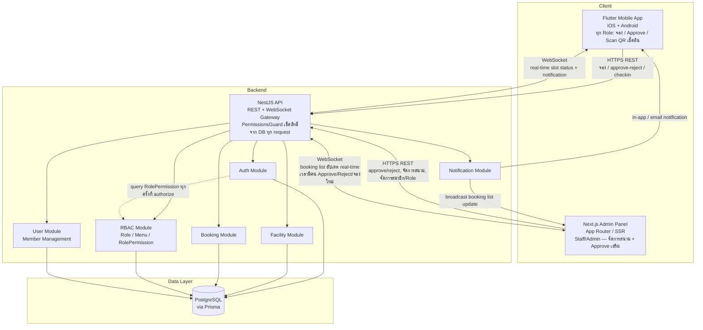
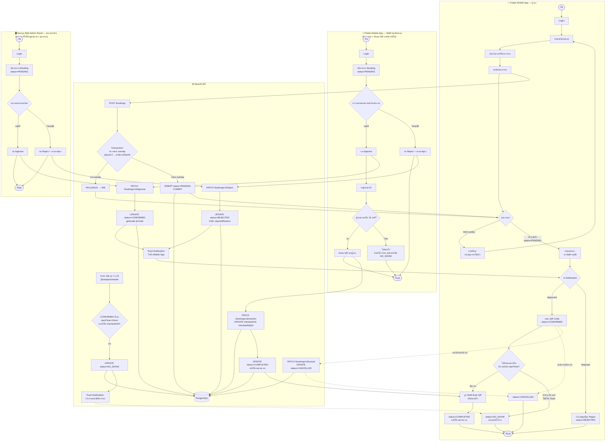
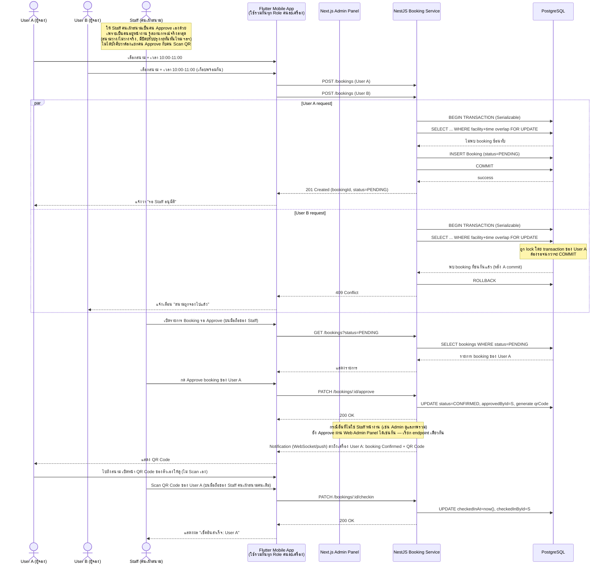
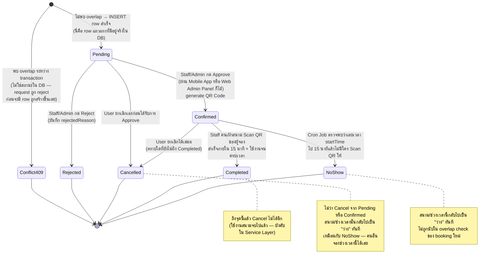

# UniPlay — Project Plan (Phase 1)

## 1. Project Overview

**เป้าหมาย:** ระบบจองสนามกีฬาในมหาวิทยาลัย (ฟุตบอล, บาสเกตบอล, แบดมินตัน ฯลฯ) แบบเรียลไทม์ ใช้งานง่าย รวดเร็ว

**Tech Stack:**
- **Mobile App (ทุก Role):** Flutter (Dart) — รองรับทั้ง iOS และ Android จาก codebase เดียว
  - **นิสิต/นักศึกษา, อาจารย์, บุคลากร:** จองสนาม, ดูตาราง, แสดง QR Code ของตัวเองตอนไปถึงสนาม
  - **Staff/Admin:** **Approve/Reject การจองผ่าน Mobile App ได้เช่นกัน** (ไม่ได้จำกัดแค่ Web Admin Panel) + หน้าจอสำหรับ**คนเฝ้าสนาม** ใช้กล้อง Scan QR Code ของผู้จองเพื่อเช็คอิน
- **Web Admin Panel (Staff/Admin เท่านั้น):** Next.js (App Router), Tailwind CSS — จัดการสนาม, ตารางเวลา, และ Approve/Reject การจอง (ช่องทางเสริมสำหรับงานที่ต้องดูภาพรวม/รายงาน)
- **Backend:** NestJS (TypeScript), REST API / WebSocket — ให้บริการทั้ง Mobile App และ Web Admin Panel ผ่าน endpoint เดียวกัน (แยกสิทธิ์ด้วย Role ไม่ใช่ด้วยช่องทาง)
- **Database:** PostgreSQL (ผ่าน Prisma ORM)
- **Infrastructure:** Docker, Docker Compose, GitHub Actions (Linux runner สำหรับ backend/web CI; macOS runner หรือ Codemagic สำหรับ build iOS — ดู [10. Future Considerations](#10-future-considerations))

**Core Features:**
1. **User Authentication** — Login/Register (นิสิต/นักศึกษา, อาจารย์, บุคลากร, Staff, Admin) — ทุก Role ใช้ Mobile App ได้ Staff/Admin ใช้ Web Admin Panel เพิ่มเติมได้
2. **Member Management (ระบบสมาชิก)** — Web Admin Panel: Add/View/Edit/Delete สมาชิก, เปิด-ปิดใช้งานบัญชี (`isActive`), assign Role ให้สมาชิกแต่ละคน
3. **Role & Permission Management (RBAC แบบ Dynamic)** — Admin สร้าง Role ใหม่ได้เอง + กำหนดสิทธิ์ Add/View/Edit/Delete ต่อเมนูแยกทีละ Role ผ่าน Web Admin Panel โดยไม่ต้องแก้โค้ด (รายละเอียด schema ดูหัวข้อ [7. Prisma Schema](#7-prisma-schema-draft))
4. **Facility & Schedule Management** — ค้นหาสนาม ดูตารางเวลาว่างแบบเรียลไทม์ (Mobile App), จัดการสนาม (Web Admin Panel)
5. **Booking System** — ผู้ใช้จองสนามผ่าน Mobile App, ป้องกันการจองชนกัน (Race Condition), **Staff/Admin ต้อง Approve ทุกการจองผ่าน Mobile App หรือ Web Admin Panel ก่อนจึงจะ Confirmed** — จัดการสถานะ (Pending, Confirmed, Rejected, Cancelled, No-Show, Completed)
6. **Check-in / QR Code** — ผู้จองแสดง QR Code ของตัวเองในแอป **คนเฝ้าสนาม (Staff) เป็นคน Scan QR ของผู้จอง** ผ่าน Mobile App เพื่อยืนยันการเช็คอิน (ผู้จองไม่ได้ Scan เอง)
7. **Notification** — แจ้งเตือนสถานะการจอง (in-app / email เป็นค่าเริ่มต้น — ยังไม่ผูกกับผู้ให้บริการภายนอกรายใดในเฟสนี้)

**ไม่รวมในเฟสนี้ (Explicitly out of scope for Phase 1):**
- Redis — ยังไม่ตัดสินใจ ดูหัวข้อ [10. Future Considerations](#10-future-considerations)

---

## 2. Working Agreement (Agentic Workflow)

- **Plan First:** ก่อนเขียนโค้ดฟีเจอร์ใดๆ วางแผน Architecture / Flow / DB Schema / API Contract ก่อนทุกครั้ง
- **Step-by-Step:** พัฒนาทีละโมดูล เพื่อให้รีวิว/ทดสอบได้ง่าย
- **Self-Verification:** ตรวจสอบ Type Safety, Error Handling ทุกครั้งที่เขียนโค้ดเสร็จ พร้อมบอกคำสั่งรันเทส/ตรวจสอบ
- **Clean Code:** แยกโฟลเดอร์ตาม Best Practice ของ NestJS (Controller → Service → Repository/Prisma) และ Next.js

**Testing Standard:**
- **Unit Testing:** Jest — ทดสอบ Business Logic ใน Service Layer (NestJS)
- **E2E Testing:** Playwright — ทดสอบ Flow การใช้งานจริงตั้งแต่ต้นจนจบ
- ทุกฟีเจอร์ใหม่ต้องมี Test Case/Script คู่กันไปเสมอ (TDD/BDD approach)

---

## 3. System Architecture Diagram



> Redis (distributed lock / pub-sub) และ external LINE OA notification service ถูกตัดออกจากไดอะแกรมนี้ตามการตัดสินใจ — ดู [10. Future Considerations](#10-future-considerations)
> **Admin Panel ก็ต่อ WebSocket ด้วย** (ไม่ใช่แค่ Mobile App) เพื่อให้หน้า "รายการ Booking รอ Approve" อัปเดต real-time เวลามีคน Approve/Reject/จองใหม่จากที่อื่น — กันไม่ให้ Staff คนละคนเห็นข้อมูลไม่ตรงกันหรือ Approve ซ้ำ
> iOS build ของ Flutter Mobile App ต้องผ่าน CI ที่มี macOS runner (GitHub Actions macOS runner หรือ Codemagic) เนื่องจากเครื่อง dev หลักเป็น Windows

---

## 4. Booking Process Flowchart (ครบทุก Platform)



> Flowchart นี้แสดงภาพรวม flow ข้าม 4 platform พร้อมกัน (Mobile App ผู้จอง, Mobile App Staff, Backend, Web Admin Panel) — ใช้คู่กับ Sequence Diagram (หัวข้อ 5, เจาะรายละเอียด race-condition/timing) และ State Diagram (หัวข้อ 6, เจาะวงจรสถานะ) เพื่อให้เห็นทั้งภาพกว้างและรายละเอียด
> **Staff คนเฝ้าสนาม (StaffMobile) เป็นช่องทางหลักสำหรับ Approve** เพราะรู้สถานการณ์จริงหน้างาน — Web Admin Panel เป็นช่องทางเสริมสำหรับ Admin ที่ไม่ได้อยู่หน้างาน หรือดูภาพรวม/รายงาน

---

## 5. Sequence Diagram — Booking Flow



> ไม่มีขั้นตอนชำระเงิน — แต่ทุกการจองต้องผ่าน **Staff/Admin Approve ผ่าน Web Admin Panel** ก่อนจึงเปลี่ยนเป็น `CONFIRMED` และได้ QR Code (เดิมออกแบบเป็น auto-confirm ทันทีหลัง conflict check — เปลี่ยนตามที่ยืนยันว่าต้องมีขั้นตอน Approve)

---

## 6. State Diagram — Booking Status Lifecycle



**คำอธิบายทีละสถานะ (เดินตามลูกศรจากบนลงล่าง):**

1. **`[*]` (จุดเริ่มต้น) → `Conflict409` หรือ `Pending`** — ทุกครั้งที่มีคนกด "จอง" ระบบจะเปิด transaction ตรวจสอบ overlap ก่อนเสมอ (ดูรายละเอียดที่หัวข้อ [5. Sequence Diagram](#5-sequence-diagram--booking-flow))
   - **`Conflict409`** — ถ้าเจอ booking อื่นที่เวลาซ้อนทับอยู่แล้ว → transaction `ROLLBACK`, ตอบ `409` กลับไปที่ Mobile App ทันที **ไม่มี row ถูกสร้างใน DB เลย** จุดนี้สำคัญ: `Conflict409` ไม่ใช่ enum value ใน `BookingStatus` (ไม่เหมือน `Rejected`) มันคือ "ไม่เคยเกิด booking นี้ขึ้นจริง" ไม่ใช่ "เกิดแล้วแต่ถูกปฏิเสธ"
   - **`Pending`** — ถ้าไม่เจอ overlap → `INSERT` row เข้า DB จริง ด้วย `status=PENDING` นี่คือสถานะแรกที่มีตัวตนจริงในระบบ และเป็นสถานะที่ **รอการตัดสินใจจากคน** (Staff/Admin) เสมอ ไม่มีทางกลายเป็น `Confirmed` เองโดยอัตโนมัติ

2. **จาก `Pending` ไปได้ 3 ทาง** (ทั้งหมดเกิดจากการกระทำของคน ไม่ใช่ระบบอัตโนมัติ):
   - **→ `Confirmed`** — Staff/Admin กด Approve ระบบ generate QR Code ให้ทันที **กด Approve ได้ทั้งจาก Mobile App และ Web Admin Panel** เพราะ endpoint เดียวกัน ตรวจสิทธิ์ด้วย Role ไม่ใช่ด้วยช่องทางที่ใช้
   - **→ `Rejected`** — Staff/Admin กด Reject พร้อมกรอกเหตุผล (บันทึกใน `rejectedReason`) จบ flow ตรงนี้
   - **→ `Cancelled`** — User เปลี่ยนใจยกเลิกเองก่อนที่ Staff จะทันได้ approve/reject

3. **จาก `Confirmed` ไปได้ 3 ทาง** (ตอนนี้ booking มี QR Code แล้ว รอถึงเวลาใช้งานจริง):
   - **→ `Completed`** — Staff **คนเฝ้าสนาม** (ไม่ใช่ผู้จองเอง) ใช้ Mobile App สแกน QR Code ที่ผู้จองเปิดโชว์ ถ้าสแกนสำเร็จภายใน 15 นาทีหลัง `startTime` → เช็คอินสำเร็จ และเมื่อใช้งานครบเวลา → `Completed`
   - **→ `NoShow`** — ถ้าผ่านไป 15 นาทีแล้วไม่มีใครสแกน QR ให้เลย **Cron Job ของ Backend** (รันทุก 1 นาที ไม่ใช่คนกดเปลี่ยนสถานะ) จะเปลี่ยนสถานะเองให้เป็น `NoShow` และปล่อยสนาม/เวลาช่วงนั้นกลับไป "ว่าง" ทันที
   - **→ `Cancelled`** — User ยกเลิกเองก่อนถึงเวลาใช้งานจริง (คนละเส้นทางกับการยกเลิกตอน `Pending` แต่ปลายทางเป็น status เดียวกัน) — **สนาม/ช่วงเวลานั้นกลับไปว่างทันทีเหมือนกัน** ไม่ว่าจะ Cancel ตอนเป็น `Pending` หรือ `Confirmed` ก็ตาม

4. **สถานะจบ (`Rejected`, `Cancelled`, `Completed`, `NoShow`)** — ทั้ง 4 สถานะนี้เป็น "ทางตัน" ของ booking นั้น ๆ ไม่มี transition ออกไปไหนต่อ (ธุรกรรมนี้ถือว่าจบแล้ว) — ถ้า User ต้องการจองใหม่ ต้องสร้าง booking ใหม่ทั้งหมด ไม่ใช่นำ booking เดิมมาใช้ซ้ำ

> เหตุผลที่ `Pending` ไม่ auto-confirm: เพื่อให้ Staff/Admin มีขั้นตอนตรวจสอบก่อนอนุมัติทุกครั้งตามที่ตกลงกันไว้ — ต่างจากดีไซน์ตอนแรกที่เคยให้ auto-confirm ทันทีหลัง conflict check ผ่าน

---

## 7. Prisma Schema (Draft)

```prisma
enum FacilityType {
  FOOTBALL
  BASKETBALL
  BADMINTON
  TENNIS
  VOLLEYBALL
  SWIMMING
  OTHER
}

enum BookingStatus {
  PENDING
  CONFIRMED
  REJECTED
  CANCELLED
  NO_SHOW
  COMPLETED
}

// --- RBAC: Dynamic Role/Permission (แทน enum Role เดิม) ---

model Role {
  id          String           @id @default(uuid())
  name        String           @unique   // Admin สร้างเพิ่มได้เอง ไม่ผูกกับ enum
  isSystem    Boolean          @default(false) // true = seed มาแต่แรก (STUDENT/STAFF/ADMIN) ห้ามลบ
  users       User[]
  permissions RolePermission[]
  createdAt   DateTime         @default(now())
  updatedAt   DateTime         @updatedAt
}

model Menu {
  id          String           @id @default(uuid())
  key         String           @unique   // เช่น "facility", "booking", "user", "role"
  label       String                      // ชื่อที่แสดงในหน้า Admin Panel
  permissions RolePermission[]
}

model RolePermission {
  id         String  @id @default(uuid())
  roleId     String
  role       Role    @relation(fields: [roleId], references: [id], onDelete: Cascade)
  menuId     String
  menu       Menu    @relation(fields: [menuId], references: [id], onDelete: Cascade)
  canView    Boolean @default(false)
  canAdd     Boolean @default(false)
  canEdit    Boolean @default(false)
  canDelete  Boolean @default(false)

  @@unique([roleId, menuId])
}

// --- Member Management ---

model User {
  id        String    @id @default(uuid())
  email     String    @unique
  password  String
  name      String
  roleId    String
  role      Role      @relation(fields: [roleId], references: [id])
  isActive  Boolean   @default(true)   // ปิดใช้งานสมาชิกได้โดยไม่ต้องลบ (soft-disable)
  bookings  Booking[]
  createdAt DateTime  @default(now())
  updatedAt DateTime  @updatedAt
}

model Facility {
  id        String    @id @default(uuid())
  name      String
  type      FacilityType
  location  String?
  capacity  Int?
  isActive  Boolean   @default(true)
  bookings  Booking[]
  createdAt DateTime  @default(now())
  updatedAt DateTime  @updatedAt
}

model Booking {
  id             String        @id @default(uuid())
  userId         String
  user           User          @relation("BookingOwner", fields: [userId], references: [id])
  facilityId     String
  facility       Facility      @relation(fields: [facilityId], references: [id])
  startTime      DateTime
  endTime        DateTime
  status         BookingStatus @default(PENDING)
  qrCode         String?       @unique
  checkedInAt    DateTime?
  checkedInById  String?
  checkedInBy    User?         @relation("BookingCheckedInBy", fields: [checkedInById], references: [id])
  approvedById   String?
  approvedBy     User?         @relation("BookingApprover", fields: [approvedById], references: [id])
  rejectedReason String?
  createdAt      DateTime      @default(now())
  updatedAt      DateTime      @updatedAt

  @@index([facilityId, startTime, endTime])
}
```

`User` model ต้องเพิ่ม relation fields เพื่อรองรับทั้ง 3 บทบาทที่เกี่ยวข้องกับ Booking:
- `bookings Booking[] @relation("BookingOwner")` — การจองของ user คนนี้เอง
- `approvals Booking[] @relation("BookingApprover")` — booking ที่ user คนนี้ (Staff/Admin) เป็นผู้ Approve/Reject — เกิดได้จากทั้ง Mobile App และ Web Admin Panel เพราะเช็คสิทธิ์ที่ Role ไม่ใช่ที่ client
- `checkIns Booking[] @relation("BookingCheckedInBy")` — booking ที่ user คนนี้ (Staff ที่เฝ้าสนาม) เป็นคน Scan QR ให้เช็คอิน — **ผู้จองไม่ได้เช็คอินให้ตัวเอง**

**Dynamic RBAC (Role/Permission ต่อเมนู):**
- แทนที่จะ hardcode สิทธิ์ในโค้ด (`@Roles('STAFF','ADMIN')`) ทุก endpoint จะประกาศแค่ **ต้องใช้สิทธิ์อะไรกับเมนูไหน** เช่น `@RequirePermission('booking', 'view')` แล้วให้ `PermissionsGuard` ไป query `RolePermission` จาก DB ตาม `role` ของ user ที่ login อยู่ ว่ามี `canView/canAdd/canEdit/canDelete` หรือไม่
- **Admin สร้าง Role ใหม่ได้เองแบบ dynamic** ผ่าน Web Admin Panel (เช่น สร้าง Role "เจ้าหน้าที่รักษาความปลอดภัย" ที่เห็นแค่เมนู Booking แบบ View+Approve แต่แก้ไข Facility ไม่ได้) โดยไม่ต้องแก้โค้อหรือ deploy ใหม่
- **Seed ข้อมูลตั้งต้น (`isSystem = true`, ลบไม่ได้):**
  - Menu: `facility`, `booking`, `user`, `role`
  - Role: `STUDENT`, `LECTURER`, `STAFF`, `ADMIN` พร้อม `RolePermission` เริ่มต้นตามที่ออกแบบไว้ในหัวข้อนี้ (เช่น `ADMIN` = ติ๊กทุกอย่างทุกเมนู, `STUDENT` = `booking.canView + canAdd` เท่านั้น)
- Role ที่ `isSystem = true` ลบไม่ได้ (ป้องกัน Admin ลบ Role ตัวเองจนเข้าระบบไม่ได้) แต่ยังแก้ไข `RolePermission` ของมันได้

**Race Condition Mitigation (Phase 1):**
- `BookingService.createBooking()` ใช้ `prisma.$transaction(async (tx) => {...}, { isolationLevel: 'Serializable' })`
- ภายใน transaction: ตรวจสอบ overlap (`startTime < newEnd AND endTime > newStart`, status ∉ `[REJECTED, CANCELLED, NO_SHOW]`) ด้วย `SELECT ... FOR UPDATE` ก่อน insert — booking ใหม่เข้าสถานะ `PENDING` (รอ Staff/Admin approve) ไม่ใช่ `CONFIRMED` ทันที
- **Hardening ในอนาคต (ยังไม่ทำในเฟสนี้):** เพิ่ม PostgreSQL extension `btree_gist` + `EXCLUDE` constraint ผ่าน raw SQL migration ให้ DB ปฏิเสธ overlap เอง

**No-Show Auto-Release (สนามถูกจองไว้แต่ผู้ใช้มาช้า):**
- Booking ที่ `status = CONFIRMED` และยังไม่ `checkedInAt` เมื่อเวลาผ่าน `startTime` ไปแล้ว **15 นาที** → ระบบเปลี่ยนสถานะเป็น `NO_SHOW` โดยอัตโนมัติ และสนาม/เวลาช่วงนั้นกลับไปเป็น "ว่าง" (ไม่ถูกนับใน overlap check ของ booking ใหม่อีกต่อไป)
- Implement ด้วย **NestJS Scheduled Task** (`@nestjs/schedule`, `@Cron('* * * * *')` รันทุก 1 นาที) — query `Booking` ที่ `status=CONFIRMED AND checkedInAt IS NULL AND startTime <= now() - interval '15 minutes'` แล้ว `UPDATE status = NO_SHOW`
- ต้องมี unit test ครอบ edge case: เช็คอินตอนนาทีที่ 14:59 ต้องยังผ่าน (ไม่กลายเป็น NO_SHOW), เช็คอินหลัง 15:01 ต้องถูกปฏิเสธ (ระบบตัดไปแล้ว)

---

## 8. Implementation Plan (Backend / Web Admin Panel / Mobile App)

โครงสร้างโฟลเดอร์เบื้องต้นของทั้ง 3 platform ตาม Clean Code / Best Practice ที่ตกลงกันไว้ (หัวข้อ [2. Working Agreement](#2-working-agreement-agentic-workflow)) — ยังไม่ใช่โค้ดจริง แค่ scaffold structure ให้เห็นภาพก่อนเริ่มเขียน

**Backend (NestJS) — Controller → Service → Repository/Prisma**
```
apps/api/
├── src/
│   ├── auth/
│   │   ├── auth.controller.ts
│   │   ├── auth.service.ts
│   │   ├── auth.module.ts
│   │   ├── decorators/require-permission.decorator.ts  # @RequirePermission('booking','view')
│   │   ├── guards/permissions.guard.ts   # query RolePermission จาก DB แทน hardcode role
│   │   └── strategies/jwt.strategy.ts
│   ├── rbac/
│   │   ├── role.controller.ts            # CRUD Role
│   │   ├── role.service.ts
│   │   ├── menu.service.ts               # seed/list เมนูที่มีให้กำหนดสิทธิ์
│   │   ├── permission.service.ts         # อ่าน/เขียน RolePermission matrix
│   │   ├── rbac.module.ts
│   │   └── seed/default-roles-menus.seed.ts  # seed STUDENT/LECTURER/STAFF/ADMIN + menu
│   ├── user/
│   │   ├── user.controller.ts            # CRUD สมาชิก (Add/View/Edit/Delete, toggle isActive)
│   │   ├── user.service.ts
│   │   └── user.module.ts
│   ├── facility/
│   │   ├── facility.controller.ts
│   │   ├── facility.service.ts
│   │   └── facility.module.ts
│   ├── booking/
│   │   ├── booking.controller.ts       # POST/PATCH endpoints ทั้งหมดในหัวข้อ 4-5
│   │   ├── booking.service.ts          # transaction/overlap logic
│   │   ├── booking.module.ts
│   │   └── tasks/no-show.cron.ts       # @nestjs/schedule cron handler
│   ├── notification/
│   │   ├── notification.gateway.ts     # WebSocket
│   │   ├── notification.service.ts
│   │   └── notification.module.ts
│   └── prisma/
│       └── prisma.service.ts
```

**Web Admin Panel (Next.js) — ช่องทางเสริมสำหรับ Admin**
```
apps/admin/
├── app/
│   ├── login/page.tsx
│   ├── bookings/page.tsx           # รายการ Booking รอ Approve/Reject
│   ├── facilities/page.tsx         # จัดการสนาม
│   ├── users/page.tsx              # ระบบสมาชิก: Add/View/Edit/Delete, toggle isActive
│   ├── roles/page.tsx              # รายการ Role + ปุ่มสร้าง Role ใหม่
│   ├── roles/[id]/permissions/page.tsx  # matrix: เมนู × (View/Add/Edit/Delete) ต่อ Role
│   └── layout.tsx                  # เมนู sidebar render ตาม RolePermission ของผู้ login (ไม่ hardcode)
├── components/
└── lib/
    ├── api.ts                        # เรียก NestJS API เดียวกันกับ Mobile App
    └── socket.ts                     # WebSocket client — subscribe booking list update real-time
```

**Mobile App (Flutter) — ผู้จอง + Staff ใช้ codebase เดียวกัน แยกหน้าตาม Role**
```
apps/mobile/
├── lib/
│   ├── screens/
│   │   ├── login_screen.dart
│   │   ├── facility_list_screen.dart
│   │   ├── booking_screen.dart
│   │   ├── my_bookings_screen.dart       # ผู้จอง: ดูสถานะ + QR Code
│   │   ├── staff_approval_screen.dart    # Staff: รายการ Pending + Approve/Reject
│   │   └── staff_scan_screen.dart        # Staff: Scan QR เช็คอิน
│   ├── services/api_service.dart
│   └── models/
```

> ลำดับการ implement จริง (ใครก่อนใคร) ดูที่ [11. Phase Roadmap](#11-phase-roadmap--order-of-work) — หัวข้อนี้บอกแค่ "จะแบ่งโฟลเดอร์/โมดูลยังไง" ไม่ใช่ "ทำอะไรก่อนอะไร"

---

## 9. Test Plan

**Unit Testing (Jest) — Backend Service Layer**

```
apps/api/
├── src/
│   ├── auth/auth.service.spec.ts
│   ├── rbac/
│   │   ├── permissions.guard.spec.ts
│   │   └── role.service.spec.ts
│   ├── user/user.service.spec.ts
│   ├── facility/facility.service.spec.ts
│   └── booking/
│       ├── booking.service.spec.ts
│       └── tasks/no-show.cron.spec.ts
```

**Test Cases (Unit, Jest):**
1. **Auth:** login ด้วย credential ถูก/ผิด, บัญชีที่ `isActive=false` login ไม่ได้
2. **RBAC — PermissionsGuard:** Role ที่ไม่มี `canView` เมนูนั้น → ปฏิเสธ (403); มี `canView` แต่ไม่มี `canEdit` → แก้ไม่ได้; แก้ `RolePermission` แล้วผลเปลี่ยนทันทีโดยไม่ต้อง deploy ใหม่ (สะท้อนว่าเป็น dynamic จริง ไม่ cache ค้าง)
3. **RBAC — Role Management:** ลบ Role ที่ `isSystem=true` → ต้องถูกปฏิเสธ; สร้าง Role ใหม่ + กำหนดสิทธิ์เฉพาะบางเมนู → user ที่ถูก assign role นั้นเข้าเมนูอื่นไม่ได้
4. **Booking — Overlap:** สร้าง booking ช่วงเวลาที่ไม่ชนกัน → สำเร็จ (`PENDING`); ช่วงเวลาที่ชนกัน (แม้ไม่ตรงกันเป๊ะ) → `409`
5. **Booking — State Guard:** Approve/Reject ได้แค่ตอน `PENDING`, Cancel ไม่ได้ตอน `COMPLETED`, Checkin ไม่ได้ถ้ายังไม่ `CONFIRMED` หรือเช็คอินไปแล้ว (กัน scan ซ้ำ)
6. **No-Show Auto-Release** (ดู [7. Prisma Schema](#7-prisma-schema-draft) ส่วน "No-Show Auto-Release"):
   - `startTime` เป็นอดีต 16 นาที, ไม่มี `checkedInAt` → รัน cron handler ตรงๆ → คาด `status` เปลี่ยนเป็น `NO_SHOW`
   - `startTime` เป็นอดีตแค่ 10 นาที → รัน cron handler → คาด `status` ยังเป็น `CONFIRMED` (ยังไม่ถึงเกณฑ์ 15 นาที)
   - Booking ที่มี `checkedInAt` แล้ว → cron handler ต้องไม่แตะสถานะ แม้เลย 15 นาทีไปแล้ว

**E2E Testing (Playwright) — Web Admin Panel**

```
apps/e2e/
├── playwright.config.ts
├── fixtures/
│   ├── users.ts          # seed: student, staff, admin test accounts
│   └── facilities.ts     # seed: test facility + existing booking slot
├── tests/
│   ├── auth.spec.ts
│   ├── booking-approval.spec.ts
│   ├── user-management.spec.ts
│   └── role-permission.spec.ts
└── utils/
    └── db-reset.ts        # reset/seed DB ก่อนแต่ละ test suite
```

**Test Cases (Web Admin Panel, Playwright):**
1. **Approve Flow:** Staff ล็อกอิน → เห็นรายการ booking สถานะ `Pending` → กด Approve → สถานะใน DB เปลี่ยนเป็น `Confirmed` → mobile user ได้รับ notification/QR Code (ตรวจผ่าน API assertion)
2. **Reject Flow:** Staff กด Reject พร้อมกรอกเหตุผล → สถานะเปลี่ยนเป็น `Rejected` → `rejectedReason` ถูกบันทึก
3. **Unauthorized Access:** ผู้ใช้ที่ไม่ล็อกอิน หรือ role `STUDENT` พยายามเข้าหน้า Admin Panel → เด้งไปหน้า Login / 403
4. **Member Management:** Admin เพิ่มสมาชิกใหม่ (`Add`) → assign Role → สมาชิกใหม่ login เข้าใช้งานได้ตามสิทธิ์ของ Role นั้น; Admin กด "ปิดใช้งาน" สมาชิก → สมาชิกคนนั้น login ไม่ได้อีก (ไม่ลบข้อมูล แค่ `isActive=false`)
5. **Dynamic Role Creation:** Admin สร้าง Role ใหม่ + ติ๊กสิทธิ์เฉพาะเมนู `booking` (View เท่านั้น) → user ที่ถูก assign role นี้เข้าเมนู `facility`/`user`/`role` ไม่ได้ และกด Approve/Reject booking ไม่ได้ (มีแค่ View)

**Conflict Prevention → API-level test (Jest/Supertest หรือ Playwright `request` fixture):**
- User 2 คนจองสนามเดียวกัน/เวลาเดียวกันพร้อมกันผ่าน `POST /bookings` ด้วย `Promise.all` → คนแรกสำเร็จ (`PENDING`) คนที่สองได้ `409 Conflict`

**Mobile App (Flutter) → ยังไม่ตัดสินใจเครื่องมือ E2E:** Playwright ทดสอบเฉพาะ web ไม่ครอบคลุม Flutter — ต้องเลือกระหว่าง Flutter `integration_test` (native) หรือ Maestro/Appium ในเฟสต่อไป (ดู [10. Future Considerations](#10-future-considerations))

---

## 10. Future Considerations (ยังไม่ตัดสินใจ / ไม่ทำในเฟสนี้)

- **Redis:** อาจใช้สำหรับ Distributed Lock (ตอนมี NestJS หลาย instance) และ WebSocket Pub/Sub — ยังไม่ได้คุยกันว่าจะเข้า stack จริงหรือไม่ ต้องตัดสินใจก่อนขึ้น production หรือก่อน scale เป็นหลาย instance
- **Notification Channel:** ยังไม่ระบุผู้ให้บริการ (เช่น LINE OA, Email, Push) — ปัจจุบันออกแบบเป็น generic module ที่ยิงผ่าน WebSocket ไปยัง Mobile App
- **Mobile E2E Testing Tool:** Playwright ไม่ครอบคลุม Flutter — ต้องเลือก `integration_test`, Maestro, หรือ Appium ก่อนเริ่มเขียนเทสของ Mobile App
- **iOS Build/CI:** เครื่อง dev หลักเป็น Windows → ต้องใช้ GitHub Actions macOS runner หรือ Codemagic สำหรับ build/deploy iOS (Android build/test ได้ปกติจาก Windows) — ต้องตัดสินใจตัวไหนก่อนตั้ง CI pipeline จริง

---

## 11. Phase Roadmap / Order of Work

1. ✅ เขียนและรีวิว `plan.md` (ขั้นนี้)
2. `git init` → commit แรก → push ขึ้น `https://github.com/chonlapat323/UniPlay.git`
3. Project Setup Structure — scaffold monorepo: NestJS backend, Next.js Admin Panel, Flutter Mobile App, Docker Compose, Prisma init (ยังไม่มี business logic)
4. Implement Prisma schema จริง (`Role`/`Menu`/`RolePermission`/`User`/Booking flow ทั้งหมด) + migration แรก + seed default Role/Menu (`isSystem=true`)
5. **RBAC Module** — `PermissionsGuard`, `@RequirePermission()` decorator, Role/Menu/Permission CRUD service + unit tests (ทำก่อน Auth เพราะ Auth ต้องพึ่ง guard ตัวนี้)
6. Auth Module (NestJS) — รองรับทั้ง Mobile (ทุก Role) และ Admin Panel login, เช็ค `isActive` + unit tests
7. **User Module (Member Management)** — CRUD สมาชิก, assign Role, toggle `isActive` + unit tests
8. Facility & Schedule Module (read-side) + unit tests
9. Booking Module — สร้าง booking (`PENDING`) พร้อม transaction-based conflict handling + Approve/Reject endpoint (Staff/Admin) + unit tests
10. Web Admin Panel — หน้า Login, รายการ Booking รอ Approve, **หน้าจัดการสมาชิก (Users)**, **หน้าจัดการ Role/Permission (matrix)**
11. Playwright E2E (Admin Panel) — Approve/Reject/Unauthorized/Member Management/Dynamic Role test cases + API-level conflict test
12. Flutter Mobile App — หน้าจอง, ดูสถานะ booking, แสดง QR Code
13. Check-in/QR + No-Show Auto-Release Cron Job (`@nestjs/schedule`) + Notification Modules
14. ตัดสินใจเรื่อง iOS CI (GitHub Actions macOS runner vs Codemagic) + Mobile E2E tool ก่อนตั้ง pipeline เต็มรูปแบบ
